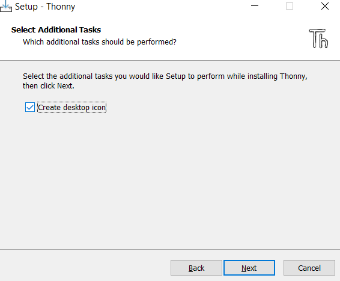
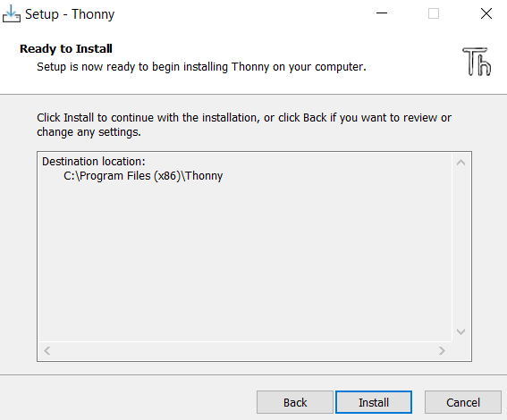
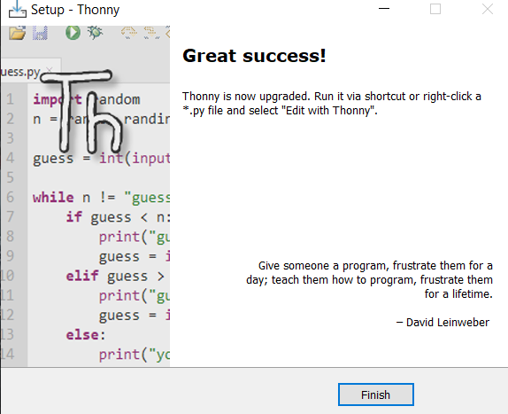
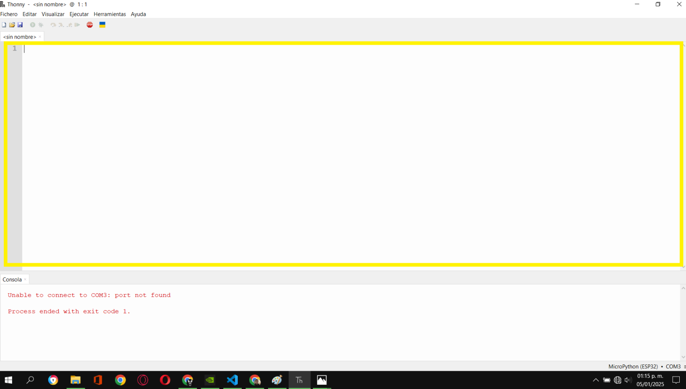
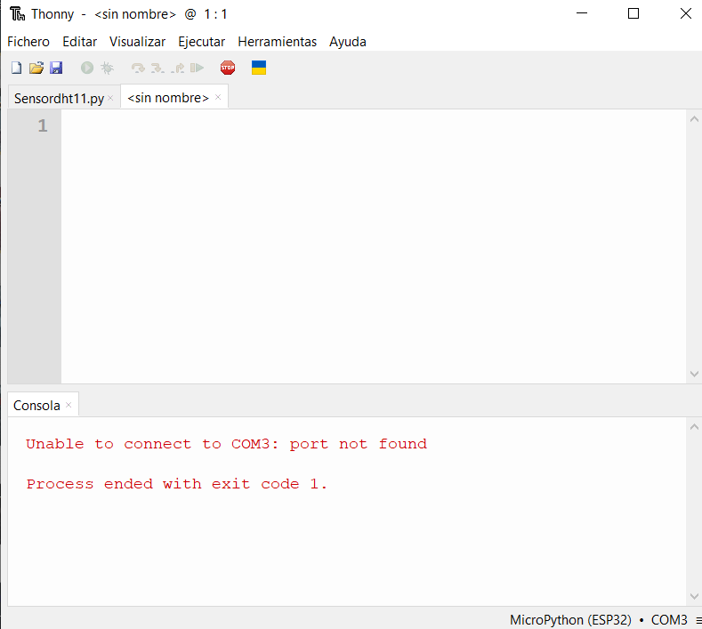

# Uso de Sensor Dht11 con Micropython.
[semana 1](/Semana1)
## Materiales:
- Sensor Dht11.
- Esp32.
- Cableado Jumper Electronica "F - F".
- Cable USB tipo A con entrada para micro puerto tipo B.
- Computadora.
- Aplicacion Thonny. 

## Instrucciones
### Instalar Thonny
1. Descarga Thonny. Para descargar a Thonny nos dirigimos a la pagina oficial al apartado de [descargas](https://github.com/thonny/thonny/releases/download/v4.1.6/thonny-4.1.6.exe).

1. Busca tu archivo descargado y lo ejecutas dandole doble click.
1. Dale al boton <kbd>Next</kbd> y despues acepta los términos.
.
1. Activa la casilla para que te ponga un icono en el escritorio.
. 
1. Da clic en <kbd>Install</kbd> para que inicie el proceso de instalación. 
1. Para finalizar la instalación hay que dar click en el boton <kbd>Finish</kbd>.

 
### Usar Thonny
1. Para empezar a programar abrimos la aplicación Thonny que estara ubicada en el Escritorio.
1. Nos ubicamos en la interfaz del interprete para comenzar a escribir el codigo. 
1. Empecemos a desarrollar una función definimos nuestras variables. 


Ahora comenzaremos a escribir el siguiente código.

Partiendo por poner a prueba lo primero que aprendemos en Python sera imprimir una simple etiqueta de texto en Python utlizamos"print(hola)".
```python
print("Hola esp32")
```
El resultado de este programa es el siguiente:
```console
Hola esp32
```
Para el siguiente ejemplo queremos solicitarle al usuario que ingrese algo escrito en la consola que se encuentra en la parte inferior de nuestra interfaz de Thonny. 
Para hacer esto utilizaremos la funcion **input**   .

```python
input("Cual es la temperatura? ")
print("Hola, ambiente")
```
El resultado del programa en la consola es el siguiente. 

```console
MPY: soft reboot
Cual es la temperatura? 32
Hola, ambiente
```
A continuacion vamos a nombrar una variable.
Para esto utilizaremos el signo **=** para asignar el valor a la variable.
Colocaremos a la derecha de este simbolo el valor que le quermos dar a nuestra variable que estara del lado izquierdo del simbolo.

```python
temperatura = input("Cual es la temperatura? ")
print("Hola Ambiente : temperatura")
```
Al obsevar el resultado nos dará la temperatura pero si esta asignando un valor a la variable temperatura. 

```console
MPY: soft reboot
Cual es la temperatura? 32
Temperatura: temperatura

```
En este ejemplo podemos solucionar la asignacion antes mencionada, agragendo un print con la variable a la que le hemos asignado el valor.

```python
temperatura = input("Cual es la temperatura? ")
print("temperatura,")
print(temperatura)
```
El resultado obtenido es el siguiente.

```console
MPY: soft reboot
Cual es la temperatura? 32
temperatura,
32
```


Comentarios.
```python 
# pregunta al usuario por su nombre.
temperatura = input("Cual es la temperatura? ")
print("temperatura,")
print(temperatura)
```
Resultado obtenido.

```console

```

Pseudocodigo.
En python utilizamos **#** para crear un Pseudocodigo, No afecta al codigo funcional nos sirve para dar instrucciones dejando notas de seguimiento por asi decirlo.

```python
# Ask the user for their temperatura
temperatura = input("Cual es la temperatura? ")

# Print Hola Ambiente
print("Hola Ambiente,")

# Print the temperatura inputted
print(temperatura)
```
Resultado obtenido. 

```console

```
Mejorando el programa.

```python
# Ask the user for their temperatura
temperatura = input("Cual es la temperatura? ")

# Print Hola Ambiente and the inputted temperatura
print("Hola Ambiente, " + temperatura)
```
El resultado obtenido es. 

```console
MPY: soft reboot
Cual es la temperatura? 32
Hola Ambiente, 32
```

Comas. 

Las comas **,**  se utilizan para pasar multiples argumentos. 
En este caso estamos ingresando dos argumentos a print, lo sabemos por que pudes ver que dice "Hola Ambiente,"**,** temperatura

```python
# Ask the user for their temperatura
temperatura = input("Cual es la temperatura? ")

# Print Hola Ambiente and the inputted temperatura
print("Hola Ambiente,", temperatura)
```
El resultado del programa es. 

```console
```
Cadenas y parametros.

Para representar una cadena utilizamos **str** nos sirven para realizar secuencias de texto. 

```python
# Ask the user for their name
name = input("What's your name? ")
print("hello,")
print(name)
```
Modificaciones 

```python
# Ask the user for their name
name = input("What's your name? ")
print("hello,", end="")
print(name)
```
Formato cadenas 

```python
# Ask the user for their name
name = input("What's your name? ")
print(f"hello, {name}")
```
Mas sobre cuerdas 

```python
# Ask the user for their name
name = input("What's your name? ")

# Remove whitespace from the str
name = name.strip()

# Print the output
print(f"hello, {name}")

```
Uso de tilte

```python
# Ask the user for their name
name = input("What's your name? ")

# Remove whitespace from the str
name = name.strip()

# Capitalize the first letter of each word
name = name.title()

# Print the output
print(f"hello, {name}")
```
Mejoramos mas el codigo para que obtengamos una mayor eficiencia

```python
# Ask the user for their name
name = input("What's your name? ")

# Remove whitespace from the str and capitalize the first letter of each word
name = name.strip().title()

# Print the output
print(f"hello, {name}")
```
El siguiente codigo es para que mejorermos mas el programa.
obteniendo los mismos resultados. 

```python
# Ask the user for their name, remove whitespace from the str and capitalize the first letter of each word
name = input("What's your name? ").strip().title()

# Print the output
print(f"hello, {name}")
```
Numeros enteros o int.

```python 
x = 1
y = 2

z = x + y

print(z)
```
interacion con input.

```python
x = input("What's x? ")
y = input("What's y? ")

z = x + y

print(z)
```
cancatenamos dos cadenas mediante signos 

```python
x = input("What's x? ")
y = input("What's y? ")

z = int(x) + int(y)

print(z)
```

El uso de int(x).

```python 
x = int(input("What's x? "))
y = int(input("What's y? "))

print(x + y)

```

Conceptos basicos de flotacion.

```python 
x = float(input("What's x? "))
y = float(input("What's y? "))

print(x + y)
```

```python 
# Get the user's input
x = float(input("What's x? "))
y = float(input("What's y? "))

# Create a rounded result
z = round(x + y)

# Print the result
print(z)
```

```python 
# Get the user's input
x = float(input("What's x? "))
y = float(input("What's y? "))

# Create a rounded result
z = round(x + y)

# Print the formatted result
print(f"{z:,}")
```

Mas sobre los flotadores 

```python 
# Get the user's input
x = float(input("What's x? "))
y = float(input("What's y? "))

# Calculate the result
z = x / y

# Print the result
print(z)
```

```python
# Get the user's input
x = float(input("What's x? "))
y = float(input("What's y? "))

# Calculate the result and round
z = round(x / y, 2)

# Print the result
print(z)
```

```python
# Get the user's input
x = float(input("What's x? "))
y = float(input("What's y? "))

# Calculate the result
z = x / y

# Print the result
print(f"{z:.2f}")

```

Definion

```python
# Ask the user for their name, remove whitespace from the str and capitalize the first letter of each word
name = input("What's your name? ").strip().title()

# Print the output
print(f"hello, {name}")
```

```python
name = input("What's your name? ")
hello()
print(name)
```

```python
def hello():
    print("hello")


name = input("What's your name? ")
hello()
print(name)
```

```python
# Create our own function
def hello(to):
    print("hello,", to)


# Output using our own function
name = input("What's your name? ")
hello(name)
```

```python
# Create our own function
def hello(to="world"):
    print("hello,", to)


# Output using our own function
name = input("What's your name? ")
hello(name)

# Output without passing the expected arguments
hello()
```

```python
def main():

    # Output using our own function
    name = input("What's your name? ")
    hello(name)

    # Output without passing the expected arguments
    hello()


# Create our own function
def hello(to="world"):
    print("hello,", to)
```

```python
def main():

    # Output using our own function
    name = input("What's your name? ")
    hello(name)

    # Output without passing the expected arguments
    hello()


# Create our own function
def hello(to="world"):
    print("hello,", to)


main()
```
Devolviendo valores 

```python
def main():
    x = int(input("What's x? "))
    print("x squared is", square(x))


def square(n):
    return n * n


main()
```


### Aplicasion thonny con el sensor Dht11

ESTO ES EL PROGRAMA FINAL
```python
from machine import Pin
import dht
s = dht.DHT11(Pin(15))
temp = s.temperature()
hum = s.humidity()

# IMPRIMEREMOS
print("Temperatura ",temp)
print("Humedad: " + hum)
```
El resultado de este programa es:
```console
Temperatura 34
Humedad: 68
```
```python
from machine import Pin
import dht
s = dht.DHT11(Pin(15))

temp = s.temperature()
hum = s.humidity()

# IMPRIMEREMOS
print("Temperatura {temp}" )
print("Humedad: {hum}")
```


```python
from machine import Pin
import dht
s = dht.DHT11(Pin(15))

temp = s.temperature()
hum = s.humidity()

suma = int(temp) + int(hum)

# IMPRIMEREMOS
print("Suma {sum}" )
```
