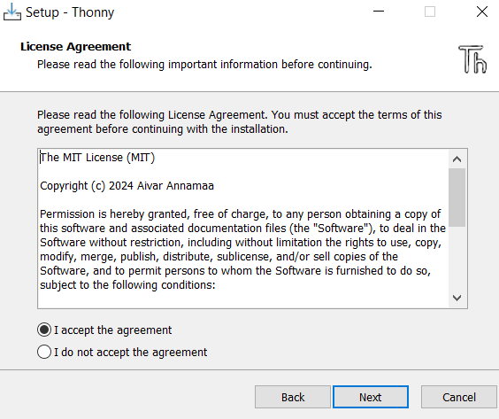

# Funciones y variables con Micropython.
- [Materiales](#materiales)
- [Instalar Thonny](#instalar-thonny)
- [Usar Thonny](#usar-thonny)
- [Conentar el sensor DHT11 a nuestro esp32](#conectar-el-sensor-dht11-a-nuestro-esp32)
- [Variables](#variables)
- [Comentarios](#comentarios)
- [Pseudocodigo](#pseudocodigo)
- [Mejorando](#mejorando-el-primer-programa)
- [Comas](#comas)
- [Cadenas_y_parametros](#cadenas-y-parametros)
- [Modificaciones](#modificaciones)
- [Formato_cadenas](#formato-cadenas)
- [Mas_sobre_cuerdas](#mas-sobre-cuerdas)
- [Uso_de_title](#uso-de-tilte)
- [Numeros_enteros_o_int](#numeros-enteros-o-int)
- [Conceptos_basicos_de_flotacion](#conceptos-basicos-de-flotacion)
- [Mas_sobre_los_flotadores](#mas-sobre-los-flotadores)
- [Definicion](#definicion)
- [Devolviendo_valores](#Devolviendo_valores)
- [Aplicasion_thonny_con_el_sensor_Dht11](#aplicasion-thonny-con-el-sensor-dht11)
  
## Materiales
La lista de materiales es:
- Sensor DHT11
- Esp32
- Cableado Jumper Electronica "F - F"
- Cable USB tipo A con entrada para micro puerto tipo B
- Computadora
- Aplicacion Thonny 

## Instalar Thonny
Descarga Thonny. Para descargar a Thonny nos dirigimos a la pagina oficial al apartado de [descargas](https://github.com/thonny/thonny/releases/download/v4.1.6/thonny-4.1.6.exe).
Busca tu archivo descargado y lo ejecutas dandole doble click.
Dale al boton <kbd>Next</kbd> y despues acepta los términos.
.

Activa la casilla para que te ponga un icono en el escritorio.
Con esto podras tener un acceso rapido en tu escritorio.
.

Da click en <kbd>Install</kbd> para que inicie el proceso de instalación.
Este proceso puede tomar tiempo, dependerá de el procesador de tu computadora. 


Para finalizar la instalación hay que dar click en el boton <kbd>Finish</kbd>.
O simplemente puedes cerrar la ventana.

 
## Usar Thonny
Para empezar a programar abrimos la aplicación Thonny que estara ubicada en el Escritorio.
Nos ubicamos en la interfaz del interprete para comenzar a escribir el codigo.
Al abrir el programa te abrira tambien un archivo en el que podras empezar a programar.

En la siguiente imagen esta señalado con un cadro amarillo donde podras editar este archivo. 


Notarás que en la consola, señalada en el recuadro amarillo de la siguiente imagen, no indica que no esta conectado el puerto COM 3.
Esto quiere decir que tienes que conectar tu esp32 con el cable USB a tu compuadora.
Duespues de esto, ve al menú **Ejecutar** y despues de click en **Detener/Reinicia back end**.


## Conectar el sensor DHT11 a nuestro esp32
Asegurate que los datos del DHT11 estan conectados al pin 15


Ahora comenzaremos a escribir el siguiente código.
Partiendo por poner a prueba lo primero que aprendemos en Python sera imprimir una simple etiqueta de texto en Python utlizando la función **print**.
Para ejecutarlo ve al menú **Ejecutar** y da click en **Ejecutar el script actual**.
De igual forma puedes presionar en tu teclado al tecla <kbd>F5</kbd>.
```python
print("Hola esp32")
```
El resultado de este programa es el siguiente:
```console
Hola esp32
```

Para el siguiente ejemplo queremos solicitarle al usuario que ingrese algo escrito en la consola que se encuentra en la parte inferior de nuestra interfaz de Thonny. 
Para hacer esto utilizaremos la funcion **input**.
```python
input("Cual es la temperatura? ")
print("Hola, ambiente")
```
El resultado del programa en la consola es el siguiente: 
```console
MPY: soft reboot
Cual es la temperatura? 32
Hola, ambiente
```

## Variables

A continuacion vamos a nombrar una variable.
Para esto utilizaremos el signo **=** para asignar el valor a la variable.
Colocaremos a la derecha de este simbolo el valor que le quermos dar a nuestra variable que estara del lado izquierdo del simbolo.
```python
temperatura = input("Cual es la temperatura? ")
print("La temperatura es: temperatura")
```
Al obsevar el resultado notarás que no nos dará la temperatura y solo esta imprimiendo **La temperatura es: temperatura**.
Pero si esta asignando un valor a la variable **temperatura**, no obstante no lo esta imprimiendo:
```console
MPY: soft reboot
Cual es la temperatura? 32
La temperatura es: temperatura
```
En este ejemplo podemos solucionar que si nos imprima la temperatura que hemos ingresado de la siguiente forma.
```python
temperatura = input("Cual es la temperatura? ")
print("La temperatura es: ")
print(temperatura)
```
El resultado obtenido es el siguiente:
```console
MPY: soft reboot
Cual es la temperatura? 32
La temperatura es: 
32
```

## Comentarios

En python utilizamos **#**  para comentar una linea mediante los bloques de codigo podemos informar al programador sobre la lo que trata el bloque de código. 
```python 
# Preguntamos al usuario que ingrese la temperatura
temperatura = input("Cual es la temperatura? ")
print("La temperatura es: ")
print(temperatura)
```
Resultado obtenido.
```console
MPY: soft reboot
Cual es la temperatura? 32
La temperatura es: 
32
```

## Pseudocodigo

El pseudocódigo es una herramienta utilizada para describir la lógica de un programa de manera estructurada, sin depender de un lenguaje de programación específico. En Python, podemos representar un pseudocódigo utilizando comentarios, los cuales no afectan la ejecución del código, pero sirven para documentar y mejorar su comprensión.
A continuación, se presenta un ejemplo en el que solicitamos al usuario ingresar una temperatura y luego la mostramos en pantalla.
```python
# Solicitamos al usuario que ingrese la temperatura
temperatura = input("¿Cuál es la temperatura? ")

# Mostramos un mensaje en pantalla
print("La temperatura es: ")

# Imprimimos la temperatura ingresada
print(temperatura)
```
Salida esperada. 
```console
MPY: soft reboot
¿Cuál es la temperatura? 32
La temperatura es: 
32
```

## Mejorando el programa anterior

En este ejemplo, optimizaremos el código anterior combinando las dos llamadas a print() en una sola línea. Esto mejora la eficiencia y mantiene el código más limpio y legible. 
Se optimiza la impresión en pantalla concatenando el texto "La temperatura es: " con la variable temperatura dentro de una única instrucción print().
```python
# Solicitamos al usuario que ingrese la temperatura
temperatura = input("¿Cuál es la temperatura? ")

# Mostramos el mensaje y la temperatura en una sola línea
print("La temperatura es: " + temperatura)
```
El resultado obtenido es. 
```console
MPY: soft reboot
¿Cuál es la temperatura? 32
La temperatura es: 32
```

## Comas 

Las comas **,**  se utilizan para pasar multiples argumentos. 
En este caso estamos ingresando dos argumentos a print, lo sabemos por que pudes ver que dice "Hola Ambiente," **,** temperatura.
```python
# Le preguntamos al usuario por la temperatura
temperatura = input("Cual es la temperatura? ")

# Impriminmos Hola Ambiente y ingresamos la temperatura
print("la temperatura es,", temperatura)
```
El resultado del programa es. 
```console
MPY: soft reboot
Cual es la temperatura? 32
la temperatura es, 32
```

## Cadenas y parametros

Para representar una cadena utilizamos **str** nos sirven para realizar secuencias de texto. 
En Python, el tipo de dato str se utiliza para representar cadenas de texto. Estas cadenas permiten almacenar y manipular secuencias de caracteres, lo que resulta útil para diversas aplicaciones, como la comunicación con interfaces de usuario, el procesamiento de datos y la interacción con sistemas embebidos.
```python
# Preguntamos al usuario por la temperatura
temperatura = input("Cual es la temperatura? ")
print("la temperatura es,")
print(temperatura)
```
El resultado obtenido es 
```console
MPY: soft reboot
Cual es la temperatura? 32
la temperatura es,
32
```

## Modificaciones 

En el siguiente ejemplo podemos modificar nuestro codigo de la siguiente forma.
Para no crear una linea nueva, Usamos **end=""**.  
```python
# Preguntamos al usuario por la temperatura
temperatura = input("Cual es la temperatura? ")
print("la temperatura es,", end="")
print(temperatura)
```
El resultado obtenido es 
```console
MPY: soft reboot
Cual es la temperatura? 32
la temperatura es,32
```

## Formato cadenas 

Para usar las cadenas en el ejemplo que se muestra a continuacion probablemente sea una forma mas elegente para programar en python. Utilizamos **f** un indicador especial para que Python trate la cadena de un modo distinto a los enfoques anteriores.  
```python
# Preguntamos al usuario por la temperatura
temperatura = input("Cual es la temperatura? ")
print(f"la temperatura es, {temperatura}")
```
El resultado obtenido es 
```console
MPY: soft reboot
Cual es la temperatura? 32
la temperatura es, 32
```

## Mas sobre cuerdas 

```python
# Preguntamos al usuario por la temperatura
temperatura = input("Cual es la temperatura? ")

# Eliminamos los espacios en blanco de la cadena 
temperatura = temperatura.strip()

# Imprimimos la salida
print(f"La temperatura es, {temperatura}")
```
El resultado obtenido es 
```console
MPY: soft reboot
Cual es la temperatura? 32
La temperatura es, 32
```

## Uso de tilte

Si colocamos title en nuestro codigo nos va a servir para poner en mayuscula el nombre del Usuario.
En consola obserbaremos los resultados en donde se muestra. 
```python
# Preguntamos al usuario por la temperatura
temperatura = input("Cual es la temperatura? ")

# Eliminamos los espacios en blanco de la cadena 
temperatura = temperatura.strip()

# Escribimos con mayuscula la primera letra de cada palabra 
temperatura = temperatura.capitalize()

# Imprimimos la salida
print(f"hola ambiente, {temperatura}")
```
El resultado obtenido es 
```console

```
Mejoramos mas el codigo para que obtengamos una mayor eficiencia.
```python
# Preguntamos al usuario por la temperatura
temperatura = input("Cual es la temperatura? ")

# Eliminamos los espacios en blanco de la cadena y escribimos con mayuscula la primera letra de cada palabra
temperatura = temperatura   

# Imprimimos la salida
print(f"la temperatura es, {temperatura}")
```
El resultado obtenido es 
```console
MPY: soft reboot
Cual es la temperatura? 32
la temperatura es, 32
```
El siguiente codigo es para que mejorermos mas el programa.
obteniendo los mismos resultados. 
```python
# Preguntamos al usuario por la temperatura, Eliminamos los espacios en blanco de la cadena y escribimos con mayuscula la primera letra de cada palabra
temperatura = input("Cual es la temperatura? ").strip().title()

# Imprimimos la salida
print(f"hola ambiente, {temperatura}")
```
El resultado obtenido es 
```console

```

## Numeros enteros o int
En python a los numeros enteros se les denomina **int**. 
Al estar familiarizados con las matematcicas podemos hacer uso de los operadores logicos como lo son.
**+**, **-**, **/** y **%**. 
Notaras que te estoy agregando 4 lineas.
Quiero que por el momento solo las incluyas en tu sccript y mas adelante te explicare de que se tratan.
Por ahora basta que entiendas la temperatura de tu sensor se esta asignando a la variable **x**.

```python 
from machine import Pin
import dht

sensor = dht.DHT11(Pin(15))
sensor.measure()
# Convertimos a entero
x = int(sensor.temperature())  
# Variable entero
y = 2  
# Suma de entero
z = x + y  

print(z)
```
El resultado obtenido es.
```console
MPY: soft reboot
30
```

## Conceptos basicos de flotante
Los valores flotantes son numeros reales con puntos decimales, Por ejemplo **0.22** dando asi una aproximacion a los enteros o int.
Para utilizar los valores flotantes recordemos el comando de los numeros enteros, pero en su lugar utlizaremos **float**.

```python 
x = float(input("What's x? "))
y = float(input("What's y? "))

print(x + y)
```
```python
from machine import Pin
import dht

sensor = dht.DHT11(Pin(15))
sensor.measure()
x = float(sensor.temperature())  # Convertimos a flotante
y = 2.5  # Variable flotante

z = x + y  # Suma de flotantes

print(z)
```
El resultado obtenido es. 
```console
MPY: soft reboot
24.5
```

```python 
#Obtener la entrada del usuario
x = float(input("temperatura x? "))
y = float(input("humedad y? "))

#Crear un resultado redondeado
z = round(x + y)

#imprimir el resultado
print(z)
```
El resultado obtenido es 
```console
MPY: soft reboot
temperatura x? 32
humedad y? 24
56
```
```python
from machine import Pin
import dht

sensor = dht.DHT11(Pin(15))
sensor.measure()
# Convertimos a flotante
x = float(sensor.temperature())  
# Variable flotante
y = 2.5  
# Suma de flotantes
z = round(x + y)  

print(z)
```
El resultado obtenido es 
```console
MPY: soft reboot
26
```
```python 
#Obtener la entrada del usuario
x = float(input("temperatura x? "))
y = float(input("humedad y? "))

#Crear un resultado redondeado
z = round(x + y)

#Imprimir el resultado formateado
print(f"{z:,}")
```
El resultado obtenido es 
```console
MPY: soft reboot
temperatura x? 1.1
humedad y? 1.2
2
```

## Mas sobre los flotadores 
Si deseamos redondear nuestros valores de punto flotante obtenemos un resultado que aparenta llegar hasta el infinito.
Cuando intentamos redondear valores en punto flotante, es posible que obtengamos resultados que aparentan extenderse indefinidamente. Esto se debe a las limitaciones de representación de los números en punto flotante dentro de los sistemas digitales, lo que puede generar pequeñas imprecisiones o resultados inesperados al redondear.

```python 
#Obtener la entrada del usuario
x = float(input("temperatura x? "))
y = float(input("humedad y? "))

#Calcular el resultado
z = x / y

#imprimir el resultado
print(z)
```
El resultado obtenido es 
```console
MPY: soft reboot
temperatura x? 2
humedad y? 3
0.6666667
```
Division
```python
#Obtener la entrada del usuario
x = float(input("temperatura x? "))
y = float(input("humedad y? "))

#Calcular el resultado y redondear
z = round(x / y, 2)

#imprimir el resultado
print(z)
```
El resultado obtenido es 
```console
MPY: soft reboot
temperatura x? 1.1
humedad y? 1.4
0.79
```
```python
#Obtener la entrada del usuario

x = float(input("temperatura x? "))
y = float(input("humedad y? "))

#Calcular el resultado
z = x / y

#imprimir el resultado
print(f"{z:.2f}")

```
El resultado obtenido es 
```console
MPY: soft reboot
temperatura x? 1.1
humedad y? 1.4
0.79
```

## Definicion
las definiciones en python son mejor conocidas como funciones. 
Definición
En Python, una definición se refiere comúnmente a la creación de una función. Las funciones permiten encapsular un bloque de código que puede reutilizarse en diferentes partes del programa, facilitando la organización, mantenimiento y legibilidad del código.

```python
#Pídale al usuario su nombre, elimine los espacios en blanco de la cadena y escriba en mayúscula la primera letra de cada palabra.
temperatura = input("Cual es la temperatura? ").strip().title()

#Imprimir la salida
print(f"temperatura, {temperatura}")
```
En este ejemplo es muy importante definir la funcion por lo cual generaremos un error a proposito. 
```python
temperatura = input("What's your name? ")
hello()
print(temperatura)
```
El resultado obtenido es
```console
MPY: soft reboot
What's your name? jerry
Traceback (most recent call last):
  File "<stdin>", line 2, in <module>
NameError: name 'hello' isn't defined
```
En este ejemplo hemos defininido nuestra funcion mediante las dos primeras lineas de codigo por lo cual ya no tendremos el mismo error.
```python
def hello():
    print("Ambiente")


temperatura = input("Cual es la temperatura? ")
hello()
print(temperatura)
```
El resultado obtenido es
```console
MPY: soft reboot
Cual es la temperatura? 32
Ambiente
32
```

```python
#Crear nuestra propia función
def ambiente(to):
    print("temperatura,", to)


#Salida usando nuestra propia función
temperatura = input("Cual es la temperatura? ")
ambiente(temperatura)
```
El resultado obtenido es 
```console
MPY: soft reboot
Cual es la temperatura? 32
temperatura, 32
```
```python
#Crear nuestra propia función
def ambiente(to="temperatura"):
    print("ambiente,", to)

#Salida usando nuestra propia función
name = input("Cual es la temperatura? ")
ambiente(name)

#Salida sin pasar los argumentos esperados
ambiente
```
El resultado obtenido es 
```console
MPY: soft reboot
Cual es la temperatura? 32
ambiente, 32
ambiente, temperatura
```
```python
def main():

    #Salida usando nuestra propia función
    name = input("Cual es la temperatura? ")
    temperatura(name)

    #Salida sin pasar los argumentos esperados
    temperatura()


#Crear nuestra propia función
def temperatura(to="ambiente"):
    print("temperatura,", to)
```
El resultado obtenido es 
```console
MPY: soft reboot
```

```python
def main():

    #Salida usando nuestra propia función
    ambiente = input("Cual es la temperatura? ")
    temperatura(ambiente)

    #Salida sin pasar los argumentos esperados
    temperatura()


#Crear nuestra propia función
def temperatura(to="ambiente"):
    print("temperatura,", to)


main()
```
El resultado obtenido es 
```console
MPY: soft reboot
Cual es la temperatura? 32
temperatura, 32
temperatura, ambiente
```
Devolviendo valores 

```python
def main():
    x = int(input("Cual es la temperatura x? "))
    print("la temperatura al cuadrado es ", square(x))


def square(n):
    return n * n


main()
```
El resultado obtenido es 
```console
MPY: soft reboot
Cual es la temperatura x? 3
la temperatura al cuadrado es  9
```

## Aplicasion thonny con el sensor Dht11

## ESTO ES EL PROGRAMA FINAL

A continuacion se muestra un ejemplo con lo que anteriormente hemos visto.
Para que apliquemos lo visto con un sensor DHT11 mismo que nos servira para capturar la temperatura en tiempo real.  
```python
from machine import Pin
import dht
s = dht.DHT11(Pin(15))
temp = s.temperature()
hum = s.humidity()

# IMPRIMEREMOS
print("Temperatura ",temp)
print("Humedad: " + hum)
```
El resultado de este programa es:
```console
Temperatura 34
Humedad: 68
```
```python
from machine import Pin
import dht
s = dht.DHT11(Pin(15))

temp = s.temperature()
hum = s.humidity()

# IMPRIMIMOS 
print("Temperatura {temp}" )
print("Humedad: {hum}")
```
El resultado de este programa es:
```console

```
```python
from machine import Pin
import dht
s = dht.DHT11(Pin(15))

temp = s.temperature()
hum = s.humidity()

suma = int(temp) + int(hum)

# IMPRIMEREMOS
print("Suma {sum}" )
```
El resultado de este programa es:
```console
MPY: soft reboot
Suma {sum}
>>> 32+12
44
>>> 
```
