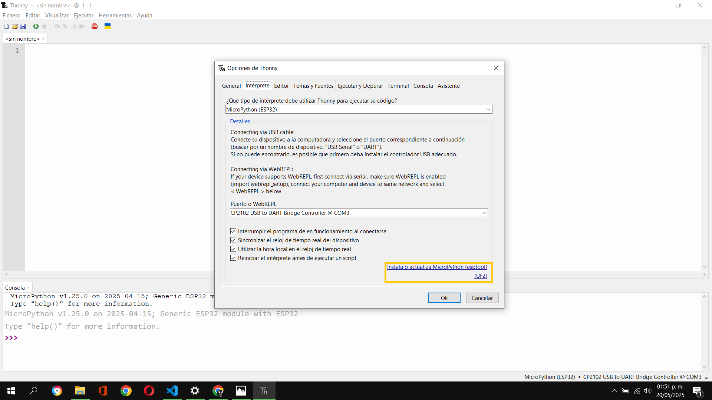

# Funciónes y variables con Micropython.

Bienbenidos [inicio](/README.md).

- [Materiales](#materiales)
- [Instalar Thonny](#instalar-thonny)
- [Instalar firmware Micropython en ESP32](#instalar-firmware-micropython-en-esp32)
- [Usar Thonny](#usar-thonny)
- [Conectar el sensor DHT11 a nuestro esp32](#conectar-el-sensor-dht11-a-nuestro-esp32)
- [Variables](#variables)
- [Comentarios](#comentarios)
- [Pseudocodigo](#pseudocodigo)
- [Mejorando el programa anterior](#mejorando-el-programa-anterior)
- [Comas](#comas)
- [Cadenas_y_parametros](#cadenas-y-parametros)
- [Modificaciones](#modificaciones)
- [Formato_cadenas](#formato-cadenas)
- [Mas_sobre_cuerdas](#mas-sobre-cuerdas)
- [Numeros_enteros_o_int](#numeros-enteros-o-int)
- [Conceptos_basicos_de_flotacion](#conceptos-basicos-de-flotacion)
- [Mas_sobre_los_flotadores](#mas-sobre-los-flotadores)
- [Definicion](#definicion)
- [Devolviendo valores](#devolviendo-valores)
- [Aplicasion_thonny_con_el_sensor_Dht11](#aplicasion-thonny-con-el-sensor-dht11)
  
## Materiales
La lista de materiales es:
- Sensor DHT11
- Esp32
- Cableado Jumper Electrónica "F - F"
- Cable USB tipo A con entrada para micro puerto tipo B
- Computadora
- Aplicación Thonny 

## Instalar Thonny
Para instalar Thonny, dirígete a la página oficial en el apartado de [descargas](https://github.com/thonny/thonny/releases/download/v4.1.6/thonny-4.1.6.exe).
Una vez que se haya completado la descarga, busca el archivo en tu carpeta de descargas y haz doble clic para ejecutarlo.
En el instalador, haz clic en el botón <kbd>Next</kbd> y luego acepta los términos y condiciones.

Activa la casilla para crear un ícono en el escritorio.  
Esto te permitirá acceder rápidamente a Thonny desde tu escritorio.


Haz clic en <kbd>Install</kbd> para comenzar el proceso de instalación.  
Este procedimiento puede tardar algunos minutos, dependiendo del rendimiento del procesador de tu computadora.


Para finalizar la instalación, haz clic en el botón <kbd>Finish</kbd>.  
También puedes cerrar la ventana si lo prefieres.


## Instalar firmware Micropython en ESP32

Un firmware es el software que instalaremos en nuestro ESP32 para que pueda ejecutar instrucciones.  
Este firmware permite que el dispositivo interprete comandos a través de una interfaz, como en nuestro caso, la aplicación Thonny.
Descarga firmware. Para descargar firmware Micropython en ESP32
nos dirigimos a la pagina oficial al apartado de [descargas](https://micropython.org/download/esp32/). 
Si hacemos clic en el enlace de descargas, seremos redirigidos a una página en Google donde se encuentra el archivo.
 
Una vez que estemos en la página oficial de MicroPython, debemos desplazarnos hacia abajo hasta encontrar la sección de firmware.
 
Selecciona la última versión del firmware, que siempre aparecerá al inicio de la lista de versiones.  
Por si tienes dudas, está señalada dentro de un recuadro amarillo.  
Haz clic derecho sobre ella y selecciona la opción para iniciar la descarga.
 
Al finalizar la descarga, abre la aplicación Thonny y selecciona **Ejecutar**.  
Luego, haz clic en la primera opción: **Configurar intérprete**.

Aparecerá una ventana llamada **Opciones de Thonny**.  
Selecciona las opciones señaladas en los recuadros amarillos: **Intérprete**, **MicroPython (ESP32)** y el puerto correspondiente (en mi caso, **COM3**), que es donde está conectado mi ESP32.  
La detección del puerto es completamente automática, por lo que aparecerá el puerto al que tu computadora tenga conectado el ESP32.  

Luego, dirígete a la sección **Instalar o actualizar MicroPython**, que está señalada dentro del recuadro en la imagen, y haz clic para iniciar la instalación o actualización.  

Después de esto, se abrirá una nueva ventana llamada **Install MicroPython (esptool)**. Algunas casillas ya vendrán seleccionadas por defecto, como el puerto **COM3**, y las opciones **ESP32**, **WROOM** y la versión que descargamos (en este ejemplo, **v1.25.0**).  
Para comenzar la instalación o actualización del firmware, primero debes formatear el ESP32. Para ello, mantén presionado el botón **BOOT** (señalado con un círculo rojo en la imagen) mientras haces clic en <kbd>Instalar</kbd> (también marcado en rojo dentro de un recuadro).  
Debes mantener presionado el botón **BOOT** hasta que comience el porcentaje de instalación.  

Para finalizar, solo resta hacer clic en el botón <kbd>OK</kbd>.  

Para confirmar que tienes instalada la última versión del firmware en tu ESP32, puedes verificarlo en la parte inferior de la ventana.


## Usar Thonny
Para comenzar a programar, abre la aplicación Thonny que estará ubicada en el escritorio.  
Ubica la interfaz del intérprete, donde podrás escribir tu código.
Al iniciar el programa, se abrirá automáticamente un archivo en el que podrás comenzar a programar.  

En la siguiente imagen, el área para editar el archivo está señalada con un cuadro amarillo.  

Notarás que en la consola, señalada en el recuadro amarillo de la siguiente imagen, aparece un mensaje indicando que el puerto COM3 no está conectado.  
Esto significa que debes conectar tu ESP32 a la computadora mediante un cable USB.  
Después de conectar el dispositivo, ve al menú **Ejecutar** y haz clic en **Detener/Reiniciar backend**.  


## Conectar el sensor DHT11 a nuestro esp32
Asegúrate de que los datos del sensor DHT11 estén conectados al pin 15 del ESP32,  
el pin VCC del DHT11 al pin 3.3V del ESP32, y el pin GND del DHT11 al GND del ESP32.

Ahora comenzaremos a escribir el siguiente código.  
Como primer paso, pondremos a prueba lo básico de Python: imprimir una etiqueta de texto usando la función **print**.
Para ejecutarlo, ve al menú **Ejecutar** y haz clic en **Ejecutar el script actual**.

También puedes presionar la tecla <kbd>F5</kbd> en tu teclado para ejecutar el programa.

```python
print("Hola esp32")
```
El resultado de este programa será:
```console
Hola esp32
```
En el siguiente ejemplo, le pediremos al usuario que ingrese un dato a través de la consola, ubicada en la parte inferior de la interfaz de Thonny.
Para esto, utilizaremos la función**input**.
```python
input("Cual es la temperatura? ")
print("Hola, ambiente")
```
El resultado de este programa será:
```console
MPY: soft reboot
Cual es la temperatura? 32
Hola, ambiente
```

## Variables

A continuacion vamos a nombrar una variable.
Para esto utilizaremos el signo **=** para asignar el valor a la variable.
Colocaremos a la derecha de este simbolo el valor que le quermos dar a nuestra variable que estara del lado izquierdo del simbolo.
```python
temperatura = input("Cual es la temperatura? ")
print("La temperatura es: temperatura")
```
Al obsevar el resultado notarás que no nos dará la temperatura y solo esta imprimiendo **La temperatura es: temperatura**.
Pero si esta asignando un valor a la variable **temperatura**, no obstante no lo esta imprimiendo.
```console
MPY: soft reboot
Cual es la temperatura? 32
La temperatura es: temperatura
```
En este ejemplo, podemos corregir el programa para que imprima la temperatura ingresada de la siguiente manera:
```python
temperatura = input("Cual es la temperatura? ")
print("La temperatura es: ")
print(temperatura)
```
El resultado de este programa será:
```console
MPY: soft reboot
Cual es la temperatura? 32
La temperatura es: 
32
```

## Comentarios
En Python, utilizamos el símbolo **#** para escribir comentarios de una sola línea.  
Los comentarios permiten informar al programador sobre el propósito o funcionamiento de una parte específica del código.
Además, es buena práctica incluir comentarios al inicio de cada bloque de código para describir brevemente su función.  
Esto facilita la comprensión del programa, especialmente cuando se trabaja en equipo o se revisa el código después de un tiempo.
```python 
# Preguntamos al usuario que ingrese la temperatura
temperatura = input("Cual es la temperatura? ")
print("La temperatura es: ")
print(temperatura)
```
El resultado de este programa será:
```console
MPY: soft reboot
Cual es la temperatura? 32
La temperatura es: 
32
```

## Pseudocodigo
El pseudocódigo es una herramienta que se utiliza para describir la lógica de un programa de manera estructurada, sin depender de un lenguaje de programación específico.  
En Python, podemos representar el pseudocódigo mediante comentarios, los cuales no afectan la ejecución del programa, pero sirven para documentar y facilitar su comprensión.
A continuación, se presenta un ejemplo donde solicitamos al usuario ingresar una temperatura y luego la mostramos en pantalla.

```python
# Solicitamos al usuario que ingrese la temperatura
temperatura = input("¿Cuál es la temperatura? ")

# Mostramos un mensaje en pantalla
print("La temperatura es: ")

# Imprimimos la temperatura ingresada
print(temperatura)
```
El resultado de este programa será:
```console
MPY: soft reboot
¿Cuál es la temperatura? 32
La temperatura es: 
32
```

## Mejorando el programa anterior
En este ejemplo, optimizaremos el código anterior combinando las dos llamadas a **print()** en una sola línea.  
Esto mejora la eficiencia y mantiene el código más limpio y legible.
La impresión en pantalla se optimiza concatenando el texto `"La temperatura es: "` con la variable `temperatura` dentro de una única instrucción **print()**.

```python
# Solicitamos al usuario que ingrese la temperatura
temperatura = input("¿Cuál es la temperatura? ")

# Mostramos el mensaje y la temperatura en una sola línea
print("La temperatura es: " + temperatura)
```
El resultado de este programa será:
```console
MPY: soft reboot
¿Cuál es la temperatura? 32
La temperatura es: 32
```

## Comas 

Las comas **,**  se utilizan para pasar multiples argumentos. 
En este caso estamos ingresando dos argumentos a print, lo sabemos por que pudes ver que dice "Hola Ambiente," **,** temperatura.
Las comas **,** se utilizan para pasar múltiples argumentos a una función.  

```python
# Le preguntamos al usuario por la temperatura
temperatura = input("Cual es la temperatura? ")

# Impriminmos Hola Ambiente y ingresamos la temperatura
print("la temperatura es,", temperatura)
```
El resultado de este programa será:
```console
MPY: soft reboot
Cual es la temperatura? 32
la temperatura es, 32
```

## Cadenas y parametros
Para representar una cadena de texto en Python, utilizamos el tipo de dato **str**, que significa *string* (cadena).
Este tipo de dato se utiliza para almacenar y manipular secuencias de caracteres.  
Las cadenas de texto son especialmente útiles en aplicaciones como:
- La comunicación con interfaces de usuario,
- El procesamiento de datos,
- Y la interacción con sistemas embebidos, como el ESP32.

```python
# Preguntamos al usuario por la temperatura
temperatura = input("Cual es la temperatura? ")
print("la temperatura es,")
print(temperatura)
```
El resultado de este programa será:
```console
MPY: soft reboot
Cual es la temperatura? 32
la temperatura es,
32
```

## Modificaciones 
En el siguiente ejemplo, podemos modificar nuestro código para evitar que se cree una nueva línea al final de la impresión.  
Para lograr esto, utilizamos el parámetro **end=""** dentro de la función **print()**.
Este parámetro permite controlar lo que se imprime al final de la línea. Por defecto, **print()** agrega un salto de línea (`\n`),  
pero al usar `end=""`, evitamos ese salto y el siguiente texto se imprimirá en la misma línea.
```python
# Preguntamos al usuario por la temperatura
temperatura = input("Cual es la temperatura? ")
print("la temperatura es,", end="")
print(temperatura)
```
El resultado de este programa será:
```console
MPY: soft reboot
Cual es la temperatura? 32
la temperatura es,32
```

## Formato cadenas 
Para trabajar con cadenas en Python, existe una forma más elegante y eficiente que los métodos tradicionales: las **f-strings** (cadenas formateadas).  
Este enfoque utiliza un prefijo especial **`f`** antes de la cadena, lo que permite insertar variables o expresiones directamente dentro del texto,  
haciendo el código más legible, conciso y fácil de mantener.
Por ejemplo:
```python
nombre = "ESP32"
print(f"Hola, {nombre}")
```python
# Preguntamos al usuario por la temperatura
temperatura = input("Cual es la temperatura? ")
print(f"la temperatura es, {temperatura}")
```
El resultado de este programa será:
```console
MPY: soft reboot
Cual es la temperatura? 32
la temperatura es, 32
```

## Mas sobre cuerdas 
Nunca debes asumir que el usuario siempre cooperará como se espera. Por ello, es importante asegurarte de que los datos ingresados sean corregidos o validados adecuadamente.
Afortunadamente, las cadenas en Python tienen métodos incorporados que permiten eliminar los espacios en blanco de una cadena.
Al utilizar el método `strip` sobre una variable como `name` (por ejemplo: `name = name.strip()`), se eliminan los espacios en blanco al inicio y al final de la entrada del usuario.
Puedes modificar tu código de la siguiente manera.
```python
# Preguntamos al usuario por la temperatura
temperatura = input("Cual es la temperatura? ")

# Eliminamos los espacios en blanco de la cadena 
temperatura = temperatura.strip()

# Imprimimos la salida
print(f"La temperatura es, {temperatura}")
```
El resultado de este programa será: 
```console
MPY: soft reboot
Cual es la temperatura? 32
La temperatura es, 32
```
## Numeros enteros o int
En Python, los números enteros se denominan **int**.
Como ya estás familiarizado con las matemáticas, puedes utilizar operadores aritméticos como **+**, **-**, **/** y **%**.
A continuación, notarás que agrego cuatro líneas de código. Por el momento, solo inclúyelas en tu script. Más adelante te explicaré en detalle para qué sirven.
Por ahora, solo necesitas entender que la temperatura leída por el sensor se está asignando a la variable **x**.
```python 
from machine import Pin
import dht

sensor = dht.DHT11(Pin(15))
sensor.measure()
# Convertimos a entero
x = int(sensor.temperature())  
# Variable entero
y = 2  
# Suma de entero
z = x + y  

print(z)
```
El resultado de este programa será:
```console
MPY: soft reboot
30
```

## Conceptos basicos de flotacion
Los valores flotantes son números reales que incluyen un punto decimal. Por ejemplo: **0.22**. Estos permiten representar valores con mayor precisión en comparación con los números enteros (**int**).
Para trabajar con valores flotantes en Python, utilizamos la función **float** en lugar de **int**. Esta función convierte una entrada en un número de tipo flotante.

```python 
x = float(input("What's x? "))
y = float(input("What's y? "))

print(x + y)
```
```python
from machine import Pin
import dht

sensor = dht.DHT11(Pin(15))
sensor.measure()
x = float(sensor.temperature())  # Convertimos a flotante
y = 2.5  # Variable flotante

z = x + y  # Suma de flotantes

print(z)
```
El resultado de este programa será: 
```console
MPY: soft reboot
24.5
```

```python 
#Obtener la entrada del usuario
x = float(input("temperatura x? "))
y = float(input("humedad y? "))

#Crear un resultado redondeado
z = round(x + y)

#imprimir el resultado
print(z)
```
El resultado de este programa será:
```console
MPY: soft reboot
temperatura x? 32
humedad y? 24
56
```
```python
from machine import Pin
import dht

sensor = dht.DHT11(Pin(15))
sensor.measure()
# Convertimos a flotante
x = float(sensor.temperature())  
# Variable flotante
y = 2.5  
# Suma de flotantes
z = round(x + y)  

print(z)
```
El resultado de este programa será:
```console
MPY: soft reboot
26
```
```python 
#Obtener la entrada del usuario
x = float(input("temperatura x? "))
y = float(input("humedad y? "))

#Crear un resultado redondeado
z = round(x + y)

#Imprimir el resultado formateado
print(f"{z:,}")
```
El resultado de este programa será:
```console
MPY: soft reboot
temperatura x? 1.1
humedad y? 1.2
2
```

## Mas sobre los flotadores 
Cuando trabajamos con valores en punto flotante y tratamos de redondearlos, es posible obtener resultados que parecen extenderse indefinidamente. 
Esto ocurre debido a las limitaciones en la representación de números flotantes en los sistemas digitales. Estas limitaciones pueden generar pequeñas imprecisiones o resultados inesperados al redondear.

```python 
#Obtener la entrada del usuario
x = float(input("temperatura x? "))
y = float(input("humedad y? "))

#Calcular el resultado
z = x / y

#imprimir el resultado
print(z)
```
El resultado de este programa será:
```console
MPY: soft reboot
temperatura x? 2
humedad y? 3
0.6666667
```
Division
```python
#Obtener la entrada del usuario
x = float(input("temperatura x? "))
y = float(input("humedad y? "))

#Calcular el resultado y redondear
z = round(x / y, 2)

#imprimir el resultado
print(z)
```
El resultado de este programa será: 
```console
MPY: soft reboot
temperatura x? 1.1
humedad y? 1.4
0.79
```
```python
#Obtener la entrada del usuario

x = float(input("temperatura x? "))
y = float(input("humedad y? "))

#Calcular el resultado
z = x / y

#imprimir el resultado
print(f"{z:.2f}")

```
El resultado de este programa será:
```console
MPY: soft reboot
temperatura x? 1.1
humedad y? 1.4
0.79
```

## Definicion
En Python, las definiciones son comúnmente conocidas como **funciones**.
Una función es una forma de encapsular un bloque de código que puede reutilizarse en distintas partes del programa. Esto mejora la organización, facilita el mantenimiento y hace que el código sea más legible.
```python
#Pídale al usuario su nombre, elimine los espacios en blanco de la cadena y escriba en mayúscula la primera letra de cada palabra.
temperatura = input("Cual es la temperatura? ").strip().title()

#Imprimir la salida
print(f"temperatura, {temperatura}")
```
En este ejemplo es muy importante definir la funcion por lo cual generaremos un error a proposito. 
```python
temperatura = input("What's your name? ")
hello()
print(temperatura)
```
El resultado de este programa será:
```console
MPY: soft reboot
What's your name? jerry
Traceback (most recent call last):
  File "<stdin>", line 2, in <module>
NameError: name 'hello' isn't defined
```
En este ejemplo hemos defininido nuestra funcion mediante las dos primeras lineas de codigo por lo cual ya no tendremos el mismo error.
```python
def hello():
    print("Ambiente")


temperatura = input("Cual es la temperatura? ")
hello()
print(temperatura)
```
El resultado de este programa será:
```console
MPY: soft reboot
Cual es la temperatura? 32
Ambiente
32
```

```python
#Crear nuestra propia función
def ambiente(to):
    print("temperatura,", to)


#Salida usando nuestra propia función
temperatura = input("Cual es la temperatura? ")
ambiente(temperatura)
```
El resultado de este programa será: 
```console
MPY: soft reboot
Cual es la temperatura? 32
temperatura, 32
```
```python
#Crear nuestra propia función
def ambiente(to="temperatura"):
    print("ambiente,", to)

#Salida usando nuestra propia función
name = input("Cual es la temperatura? ")
ambiente(name)

#Salida sin pasar los argumentos esperados
ambiente
```
El resultado de este programa será:
```console
MPY: soft reboot
Cual es la temperatura? 32
ambiente, 32
ambiente, temperatura
```
```python
def main():

    #Salida usando nuestra propia función
    name = input("Cual es la temperatura? ")
    temperatura(name)

    #Salida sin pasar los argumentos esperados
    temperatura()


#Crear nuestra propia función
def temperatura(to="ambiente"):
    print("temperatura,", to)
```
El resultado de este programa será: 
```console
MPY: soft reboot
```

```python
def main():

    #Salida usando nuestra propia función
    ambiente = input("Cual es la temperatura? ")
    temperatura(ambiente)

    #Salida sin pasar los argumentos esperados
    temperatura()


#Crear nuestra propia función
def temperatura(to="ambiente"):
    print("temperatura,", to)


main()
```
El resultado de este programa será:
```console
MPY: soft reboot
Cual es la temperatura? 32
temperatura, 32
temperatura, ambiente
```
## Devolviendo valores 

```python
def main():
    x = int(input("Cual es la temperatura x? "))
    print("la temperatura al cuadrado es ", square(x))


def square(n):
    return n * n


main()
```
El resultado de este programa será:
```console
MPY: soft reboot
Cual es la temperatura x? 3
la temperatura al cuadrado es  9
```

## Aplicasion thonny con el sensor Dht11

## ESTO ES EL PROGRAMA FINAL
A continuación, se muestra un ejemplo que reúne los conceptos que hemos visto hasta ahora.
Aplicaremos este conocimiento utilizando un sensor **DHT11**, el cual nos permitirá capturar la temperatura en tiempo real.

```python
from machine import Pin
import dht
s = dht.DHT11(Pin(15))
temp = s.temperature()
hum = s.humidity()

# IMPRIMEREMOS
print("Temperatura ",temp)
print("Humedad: " + hum)
```
El resultado de este programa será:
```console
Temperatura 34
Humedad: 68
```
```python
from machine import Pin
import dht
s = dht.DHT11(Pin(15))

temp = s.temperature()
hum = s.humidity()

# IMPRIMIMOS 
print("Temperatura {temp}" )
print("Humedad: {hum}")
```
El resultado de este programa será:
```console

```
```python
from machine import Pin
import dht
s = dht.DHT11(Pin(15))

temp = s.temperature()
hum = s.humidity()

suma = int(temp) + int(hum)

# IMPRIMEREMOS
print("Suma {sum}" )
```
El resultado de este programa será:
```console
MPY: soft reboot
Suma {sum}
>>> 32+12
44
>>> 
```
