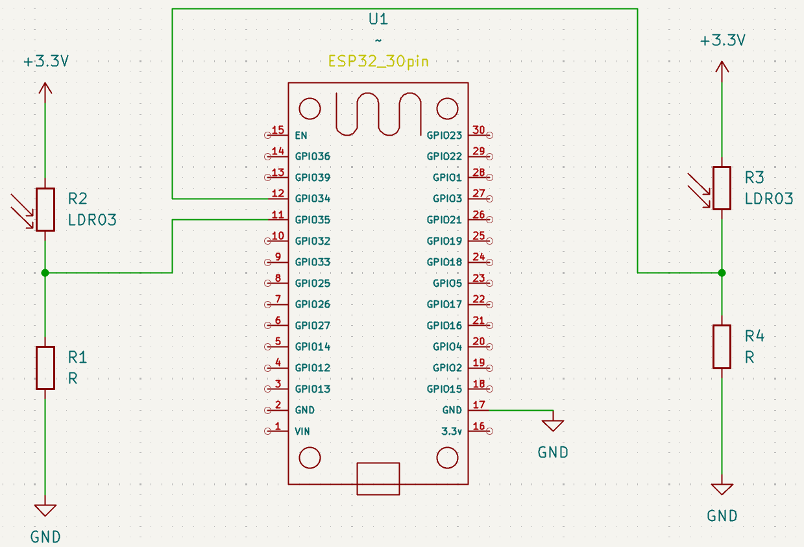

# Condicionales 

Bienbenidos [inicio](/README.md).

- [Materiales y Programas](#materiales-y-programas)
- [Coneccion de sensores LDR](#coneccion-de-sensores-ldr)
- [Usar Thonny](#usar-thonny)
- [Condicionales](#condicionales)
- [Declaraciones if](#declaraciones-if)
- [Flujo de control elif else](#flujo-de-control-elif-else)
- [Or](#or)
- [And](#and)
- [Módulo](#módulo)
- [Creando tu propia función de paridad ](#creando-tu-propia-función-de-paridad) 
- [Codificación pitónica](#codificación-pitónica)
- [Pythonic](#pythonic)
- [Match](#match)
- [Aplicacion Thonny con el sensor LDR](#aplicasion-thonny-con-el-sensor-ldr)

## Materiales y Programas
La lista de materiales es:
- 2 protoboard 
- 2 Sensores para deteccion de Luz LDR
- 2 resistencias de 10k Ohms 
- Esp32 DEVKITV1
- Cableado Jumper Electrónica "H - H" x 6
- Cable USB tipo A con entrada para micro puerto tipo B
- Computadora 
- Aplicación Thonny 
- Instrucciones Git hub

## Usar Thonny
Para empezar a usar Thonny nos ubicamos en la ventana del editor. al ya tener nuestros componentes especificados y conectados empezamos a redactar nuestro codigo.

Materiales:

1 ESP32

1 sensor LDR

1 resistencia de 10kΩ

cables de conexión

Conexión básica (divisor de voltaje):

Un extremo del LDR → 3.3V

El otro extremo del LDR → GPIO34

Resistencia de 10kΩ → entre GPIO34 y GND

Esto permite que el ESP32 lea el cambio de voltaje dependiendo de la luz.

## Coneccion de sensores LDR a nuestro esp32
Antes de comenzar debemos considerar los puentes de nuestro protoboard y conocer la distribucion vertical y Orizontal para las conecciones. En la siguiente imagen se te muestra un ejemplo de un protoboard mediante en las lineas en marcadas observamos la conductividad. 


Para empezar nesecitaremos conectar nuestro esp32 de manera que conecte los dos protoboards solicitados en la lista de materiales. despues utilizaremos nuestro cable de alimentacion para conectar el Esp32 a nuestra computadora, Enseguida colocaremos nuestros sensores y resistencias siguiendo el diagrama de la imagen. 




## Condicionales
Los condicionales permiten que un programa tome decisiones y seleccione diferentes acciones según las condiciones establecidas en el código. Estas estructuras son fundamentales en programación, ya que permiten controlar el flujo de ejecución de acuerdo con los resultados obtenidos.

En Python tenemos un conjunto de **“operadores”** que se utilizan para plantear preguntas matemáticas.

Los símbolos que utilizamos para establecer condicionales son los siguientes.

- **>=** denota “mayor o igual a”.
- **<=** denota “menor o igual a”.
- **\==** denota “igual”. Nótese el doble signo igual: un solo signo igual **=** asigna un valor, mientras que dos signos iguales **==** comparan valores.
- **!\=** denota “no igual a”.

Las declaraciones condicionales comparan un término de la izquierda con un término de la derecha.

## Declaraciones If
En Python, las sentencias **if** se utilizan para la toma de decisiones dentro de un programa. Estas estructuras permiten ejecutar un bloque de código cuando una condición se evalúa como verdadera. En caso contrario, el programa puede ejecutar instrucciones alternativas o continuar con su flujo normal de ejecución.

En la ventana del editor de thonny comenzamos a redactar nuestro ejemplo para empesar a usar **if**. 

```Python
from machine import ADC, Pin
import time

# Configurar los pines analógicos
ldr1 = ADC(Pin(34))   # Primer LDR en GPIO 34
ldr2 = ADC(Pin(35))   # Segundo LDR en GPIO 35

# Ajustar la atenuación para rango de 0 - 3.3V
ldr1.atten(ADC.ATTN_11DB)
ldr2.atten(ADC.ATTN_11DB)

valor1 = ldr1.read()   # Valor de 0 - 4095
valor2 = ldr2.read()   # Valor de 0 - 4095
    
print("LDR1:", valor1, " | LDR2:", valor2)

    # Comparación usando solo IF
if valor1 < valor2:
        print("Hay menos luz en LDR1")
    
```

```console
MPY: soft reboot
LDR1: 3712  | LDR2: 3776
Hay menos luz en LDR1
```

Solo especificamos el codigo para que el codigo indique que **"X"** es menor a **"Y"** por lo tanto solo la respuesta señalara lo antes mencionado siendo **Y** mayor que **X**. 

## Ejemplo sensor LDR
A continuación, se muestra un ejemplo de código en MicroPython que utiliza dos sensores LDR para realizar lecturas en tiempo real.

```Python
from machine import ADC, Pin
import time

# Configurar los pines analógicos
ldr1 = ADC(Pin(34))   # Primer LDR en GPIO 34
ldr2 = ADC(Pin(35))   # Segundo LDR en GPIO 35

# Ajustar la atenuación para rango de 0 - 3.3V
ldr1.atten(ADC.ATTN_11DB)
ldr2.atten(ADC.ATTN_11DB)

while True:
    valor1 = ldr1.read()   # Valor de 0 - 4095
    valor2 = ldr2.read()   # Valor de 0 - 4095
    
    print("LDR1:", valor1, " | LDR2:", valor2)

    # Comparación usando solo IF
    if valor1 < valor2:
        print("Hay menos luz en LDR1")
    
    if valor2 > valor1:
        print("Hay más luz en LDR2")
    
    if valor1 == valor2:
        print("Ambos sensores tienen la misma luz")

    time.sleep(0.5)
```
El resultado esperado es:
```Console
LDR1: 3651  | LDR2: 3764
Hay menos luz en LDR1
Hay más luz en LDR2
LDR1: 3641  | LDR2: 2071
```
Observe cómo su programa toma la entrada del usuario para x e y, convirtiéndolas en enteros y guardándolas en sus respectivas variables x e y. Luego, la instrucción compara x e y. Si se cumple ifla condición de , se ejecuta la instrucción.x < yprint

ifLas sentencias utilizan boolvalores booleanos ( Trueo False) para decidir si se ejecuta el código. Si la comparación x > yes True, el intérprete ejecuta el bloque con sangría.

## Flujo de control elif, else
Observe cómo el programa utiliza una serie de instrucciones <kbd>if</kbd>. Primero, se evalúa la primera condición; posteriormente, se analiza la segunda instrucción <kbd>if</kbd>; y finalmente, se evalúa la última condición. Este proceso de evaluación y toma de decisiones se conoce como “flujo de control”, ya que determina el orden en que se ejecutan las instrucciones dentro del programa.

```Python 
from machine import ADC, Pin
import time

# Configurar los pines analógicos
ldr1 = ADC(Pin(34))   # Primer LDR en GPIO 34
ldr2 = ADC(Pin(35))   # Segundo LDR en GPIO 35

# Ajustar la atenuación para rango de 0 - 3.3V
ldr1.atten(ADC.ATTN_11DB)
ldr2.atten(ADC.ATTN_11DB)

valor1 = ldr1.read()   # Valor de 0 - 4095
valor2 = ldr2.read()   # Valor de 0 - 4095
    
print("LDR1:", valor1, " | LDR2:", valor2)

    # Comparación usando solo IF
if valor1 < valor2:
        print("Hay menos luz en LDR1")
        
if valor1 > valor2:
        print("Hay mas luz en LDR1")
        
if valor1 == valor2:
        print("El valor en LDR1 y LDR2 es igual")
```

Posibles resultados.

**Caso 1** Para menor deteccion de Luz en **LDR1**. 
```console
MPY: soft reboot
LDR1: 3996  | LDR2: 4031
Hay menos luz en LDR1
```
**Caso 2**Para mayor deteccion de Luz en **LDR1**.
```console
MPY: soft reboot
LDR1: 4021  | LDR2: 2793
Hay mas luz en LDR1
```

## Aplicaion de elif
Observe cómo el uso de **elif** permite optimizar la toma de decisiones dentro del programa. Primero, se evalúa la condición de la instrucción **if**; si esta resulta verdadera, las demás condiciones **elif** no se ejecutarán. Sin embargo, si la condición de **if** es falsa, el programa evaluará la primera condición **elif**. Si esta se cumple, las condiciones restantes ya no serán evaluadas. De esta manera, el flujo de control se vuelve más eficiente y organizado.

```Python
from machine import ADC, Pin
import time

# Configurar los pines analógicos
ldr1 = ADC(Pin(34))   # Primer LDR en GPIO 34
ldr2 = ADC(Pin(35))   # Segundo LDR en GPIO 35

# Ajustar la atenuación para rango de 0 - 3.3V
ldr1.atten(ADC.ATTN_11DB)
ldr2.atten(ADC.ATTN_11DB)

valor1 = ldr1.read()   # Valor de 0 - 4095
valor2 = ldr2.read()   # Valor de 0 - 4095
    
print("LDR1:", valor1, " | LDR2:", valor2)

    # Comparación usando solo IF
if valor1 < valor2:
        print("Hay menos luz en LDR1")
        
elif valor1 > valor2:
        print("Hay mas luz en LDR1")
        
elif valor1 == valor2:
        print("El valor en LDR1 y LDR2 es igual")
```
Posibles respuestas para los 3 casos.

Caso 1
```console
MPY: soft reboot
LDR1: 3056  | LDR2: 4095
Hay menos luz en LDR1
```
Caso2
```console
MPY: soft reboot
LDR1: 4089  | LDR2: 3050
Hay mas luz en LDR1
```
Caso3
```console
MPY: soft reboot
LDR1: 4095  | LDR2: 4095
El valor en LDR1 y LDR2 es igual
```

## Aplicasion de else
En Python, la sentencia **else** se utiliza para definir un bloque de código alternativo que se ejecutará cuando la condición evaluada en las instrucciones **if** o **elif** sea falsa. Al programar, es importante recordar el uso correcto de la indentación, ya que esta define la estructura de los flujos de control y la toma de decisiones del tipo “Sí” y “No” dentro del programa.

```Python
from machine import ADC, Pin
import time

# Configurar los pines analógicos
ldr1 = ADC(Pin(34))   # Primer LDR en GPIO 34
ldr2 = ADC(Pin(35))   # Segundo LDR en GPIO 35

# Ajustar la atenuación para rango de 0 - 3.3V
ldr1.atten(ADC.ATTN_11DB)
ldr2.atten(ADC.ATTN_11DB)

valor1 = ldr1.read()   # Valor de 0 - 4095
valor2 = ldr2.read()   # Valor de 0 - 4095
    
print("LDR1:", valor1, " | LDR2:", valor2)

    # Comparación usando solo IF
if valor1 < valor2:
        print("Hay menos luz en LDR1")
        
elif valor1 > valor2:
        print("Hay mas luz en LDR1")
        
else: 
        print("El valor en LDR1 y LDR2 es igual")
```
Posibles respuestas para los 3 casos **if**, **elif**, **"else"**.

Caso 1 
```console
MPY: soft reboot
LDR1: 3920  | LDR2: 3966
Hay menos luz en LDR1
```
Caso 2
```console
MPY: soft reboot
LDR1: 4095  | LDR2: 3000
Hay mas luz en LDR1
```
Caso 3
```console
MPY: soft reboot
LDR1: 4095  | LDR2: 4095
El valor en LDR1 y LDR2 es igual
```

## Or
La sentencia **or** permite que un programa tome decisiones entre una o más alternativas. Esta condición lógica se cumple cuando al menos una de las condiciones evaluadas es verdadera. Por ejemplo, puede utilizarse para activar una acción cuando cualquiera de varios sensores detecte una señal o condición específica.

```Python
from machine import ADC, Pin
import time

# Configurar los pines analógicos
ldr1 = ADC(Pin(34))   # Primer LDR en GPIO 34
ldr2 = ADC(Pin(35))   # Segundo LDR en GPIO 35

# Ajustar la atenuación para rango de 0 - 3.3V
ldr1.atten(ADC.ATTN_11DB)
ldr2.atten(ADC.ATTN_11DB)

valor1 = ldr1.read()   # Valor de 0 - 4095
valor2 = ldr2.read()   # Valor de 0 - 4095
    
print("LDR1:", valor1, " | LDR2:", valor2)


if valor1 < valor2 or valor1 > valor2:
    print("valor1 no es igual al valor2")
else:
    print("valor1 es igual al valor2")

```
Posibles resultados para los dos casos es **igual** y **no es igual que**.
```console
MPY: soft reboot
LDR1: 3770  | LDR2: 3790
valor1 no es igual al valor2
```

en el siguiente ejemplo mejoramos mas aun nuestro programa eliminando el operador **or**.
```Python
from machine import ADC, Pin
import time

# Configurar los pines analógicos
ldr1 = ADC(Pin(34))   # Primer LDR en GPIO 34
ldr2 = ADC(Pin(35))   # Segundo LDR en GPIO 35

# Ajustar la atenuación para rango de 0 - 3.3V
ldr1.atten(ADC.ATTN_11DB)
ldr2.atten(ADC.ATTN_11DB)

valor1 = ldr1.read()   # Valor de 0 - 4095
valor2 = ldr2.read()   # Valor de 0 - 4095
    
print("LDR1:", valor1, " | LDR2:", valor2)


if valor1 != valor2:
    print("valor1 no es igual al valor2")
else:
    print("valor1 es igual al valor2")
```
Posibles respuestas para los dos casos es **igual** o **no es igual** que.
```console
MPY: soft reboot
LDR1: 3482  | LDR2: 2915
valor1 no es igual al valor2
```

```Python
from machine import ADC, Pin
import time

# Configurar los pines analógicos
ldr1 = ADC(Pin(34))   # Primer LDR en GPIO 34
ldr2 = ADC(Pin(35))   # Segundo LDR en GPIO 35

# Ajustar la atenuación para rango de 0 - 3.3V
ldr1.atten(ADC.ATTN_11DB)
ldr2.atten(ADC.ATTN_11DB)

valor1 = ldr1.read()   # Valor de 0 - 4095
valor2 = ldr2.read()   # Valor de 0 - 4095
    
print("LDR1:", valor1, " | LDR2:", valor2)


if valor1 == valor2:
    print("valor1 es igual al valor2")
else:
    print("valor1 no es igual al valor2")
```
Posibles  respuestas para los dos casos **no es igual** y es **igual que**. 
```console
MPY: soft reboot
LDR1: 3613  | LDR2: 3466
valor1 no es igual al valor2
```

## And
De manera similar a **or**, la sentencia **and** puede utilizarse dentro de las declaraciones condicionales. Esta condición lógica permite que un bloque de código se ejecute únicamente cuando todas las condiciones evaluadas sean verdaderas..
Ejecútalo en la ventana de terminal, Inicia tu nuevo programa como se te indica a continuación.

```Python
from machine import ADC, Pin
import time

# Configurar los pines analógicos
ldr1 = ADC(Pin(34))   # Primer LDR en GPIO 34
ldr2 = ADC(Pin(35))   # Segundo LDR en GPIO 35

# Ajustar la atenuación para rango de 0 - 3.3V
ldr1.atten(ADC.ATTN_11DB)
ldr2.atten(ADC.ATTN_11DB)

valor1 = ldr1.read()   # Valor de 0 - 4095
valor2 = ldr2.read()   # Valor de 0 - 4095
    
print("LDR1:", valor1, " | LDR2:", valor2)


if valor1 >= 3000 and valor2 <= 4095:
    print("Grade: A")
elif valor1 >=2000 and valor2 < 3000:
    print("Grade: B")
elif valor1 >=1000 and valor2 < 2000:
    print("Grade: C")
elif valor1 >=500 and valor2 < 1000:
    print("Grade: D")
else:
    print("Grade: F")
```
```console
MPY: soft reboot
LDR1: 3869  | LDR2: 3933
Grade: A
```
```console
MPY: soft reboot
LDR1: 2512  | LDR2: 3890
Grade: F
```
```console
MPY: soft reboot
LDR1: 998  | LDR2: 991
Grade: D
```

```python
from machine import ADC, Pin
import time

ldr = ADC(Pin(34))
ldr.atten(ADC.ATTN_11DB)   
ldr.width(ADC.WIDTH_10BIT) 

valor = ldr.read()
print(valor)
score = ldr.read()

if score >= 900 and score <= 1000:
    print("Grade: A")
elif score >=800 and score < 900:
    print("Grade: B")
elif score >=700 and score < 800:
    print("Grade: C")
elif score >=60 and score < 700:
    print("Grade: D")
```

```console
MPY: soft reboot
833
Grade: B
```

Observa como en Python pueden encadenarse operadores y condiciones de una manera bastante inusual en otros lenguajes de programacion. 

```Python
from machine import ADC, Pin
import time

ldr = ADC(Pin(34))
ldr.atten(ADC.ATTN_11DB)   
ldr.width(ADC.WIDTH_10BIT) 

valor = ldr.read()
print(valor)
score = ldr.read()

if score >= 90:
    print("Grade: A")
elif score >= 80:
    print("Grade: B")
elif score >= 70:
    print("Grade: C")
elif score >= 60:
    print("Grade: D")
else:
    print("Grade: F")
```
```console
MPY: soft reboot
17
Grade: F
```

## Módulo
En matemáticas, la paridad se refiere a la clasificación de un número como par o impar. En programación, el operador módulo % se utiliza para obtener el residuo de una división y determinar si un número es divisible exactamente entre otro.

Por ejemplo:

- 4 % 2 = 0, porque 4 es divisible exactamente entre 2 y no existe residuo.
- 3 % 2 = 1, porque 3 no es divisible exactamente entre 2 y la división genera un residuo distinto de cero.

Este operador es ampliamente utilizado para identificar números pares e impares dentro de un programa.
```Python 
from machine import ADC, Pin
import time


ldr = ADC(Pin(34))              # Pin analógico
ldr.atten(ADC.ATTN_11DB)        # Rango de 0 a 3.3V


def leer_ldr():
    valor = ldr.read()
    return valor


valor = leer_ldr()

print("Valor del LDR:", valor)

# Evaluar si el número es par o impar usando módulo
if valor % 2 == 0:
    print("El valor es PAR")
else:
    print("El valor es IMPAR")
```
Posibles resultados
```console
MPY: soft reboot
Valor del LDR: 351
El valor es IMPAR
```
```console
MPY: soft reboot
Valor del LDR: 746
El valor es PAR
```
Ejemplo 1
```Python
from machine import ADC, Pin
import time

ldr = ADC(Pin(34))
ldr.atten(ADC.ATTN_11DB)   
ldr.width(ADC.WIDTH_10BIT) 

valor = ldr.read()
print(valor)
score = ldr.read()


if score % 2 == 0:
    print("Even")
else:
    print("Odd")
```
```console
MPY: soft reboot
4
Even
```
ejemplo mejorado 
```Python
from machine import ADC, Pin
import time

# Configurar el pin analógico donde está conectado el LDR
ldr = ADC(Pin(34))

# Ajustar el rango de lectura (0 - 3.3V)
ldr.atten(ADC.ATTN_11DB)

# Leer el valor del sensor
valor = ldr.read()

print("Valor del LDR:", valor)

# Uso del operador módulo
if valor % 2 == 0:
    print("El valor es PAR")
else:
    print("El valor es IMPAR")
```

```console
MPY: soft reboot
Valor del LDR: 85
El valor es IMPAR
```
```console
MPY: soft reboot
Valor del LDR: 16
El valor es PAR
```

## Creando tu propia función de paridad
Como se mencionó en la lección 0, resulta muy útil crear funciones propias para organizar y reutilizar código dentro de un programa.

Por ejemplo, podemos desarrollar una función que permita verificar si un número es par o impar de manera automática y eficiente.

Modificaremos el código de la siguiente manera.

```Python
from machine import ADC, Pin
import time

# Configurar el pin analógico donde está conectado el LDR
ldr = ADC(Pin(34))

# Ajustar el rango de lectura (0 - 3.3V)
ldr.atten(ADC.ATTN_11DB)

# Leer el valor del sensor
valor = ldr.read()

print("Valor del LDR:", valor)


def main():
    valor = ldr.read()
    if is_even(valor):
        print("Par")
    else:
        print("Impar")


def is_even(n):
    if n % 2 == 0:
        return True
    else:
        return False


main()
```
Resultado
```console
MPY: soft reboot
Valor del LDR: 349
Impar
```

```Python
from machine import ADC, Pin
import time

# Configurar el pin analógico donde está conectado el LDR
ldr = ADC(Pin(34))

# Ajustar el rango de lectura (0 - 3.3V)
ldr.atten(ADC.ATTN_11DB)

# Leer el valor del sensor
valor = ldr.read()

print("Valor del LDR:", valor)


def main():
    valor = ldr.read()
    if is_even(valor):
        print("Par")
    else:
        print("Impar")


def is_even(n):
    if n % 2 == 0:
        return True
    else:
        return False


main()
```

Posibles respuestas para los dos casos par e impar Even y Odd 

```console
MPY: soft reboot
Valor del LDR: 38
Par
```
```console
MPY: soft reboot
Valor del LDR: 0
Impar
```

## Pythonic
En el mundo de la programación, existen estilos de desarrollo conocidos como **“Pythonic”**. Este término se utiliza para describir formas de programar que aprovechan las características y la filosofía propias de Python, buscando que el código sea más claro, sencillo, legible y eficiente. Muchas de estas prácticas son características distintivas del lenguaje Python.

Debemos considerar la siguiente revisión de nuestro programa:

```Python
from machine import ADC, Pin
import time

# Configurar el pin analógico donde está conectado el LDR
ldr = ADC(Pin(34))

# Ajustar el rango de lectura (0 - 3.3V)
ldr.atten(ADC.ATTN_11DB)

# Leer el valor del sensor
valor = ldr.read()

print("Valor del LDR:", valor)


def main():
    valor = ldr.read()
    if is_even(valor):
        print("Par")
    else:
        print("Impar")


def is_even(n):
    return True if n % 2 == 0 else False


main()
```

Posibles respuestas para los dos casos par e impar Even, Odd. 

```console
MPY: soft reboot
Valor del LDR: 134
Par
```
```console
MPY: soft reboot
Valor del LDR: 672
Impar
```

Observe que esta declaración de retorno en nuestro código es casi como una oración en inglés. Esta es una forma única de codificar que solo se ve en Python.

Podemos revisar aún más nuestro código y hacerlo cada vez más legible:

```python
from machine import ADC, Pin
import time

# Configurar el pin analógico donde está conectado el LDR
ldr = ADC(Pin(34))

# Ajustar el rango de lectura (0 - 3.3V)
ldr.atten(ADC.ATTN_11DB)

# Leer el valor del sensor
valor = ldr.read()

print("Valor del LDR:", valor)

def main():
    valor = ldr.read()
    if is_even(valor):
        print("Par")
    else:
        print("Impar")


def is_even(n):
    return n % 2 == 0


main()
```
Posibles respuestas para los dos casos par e impar Even, Odd. 
```console
MPY: soft reboot
Valor del LDR: 227
Par
```
```console
MPY: soft reboot
Valor del LDR: 1056
Impar
```
Tenga en cuenta que el programa evaluará la expresión n % 2 == 0 para determinar si su resultado es True o False. Posteriormente, este valor lógico será devuelto a la función principal para continuar con el flujo de ejecución del programa.

## Match
De manera similar a las sentencias **if**, **elif** y **else**, las instrucciones match pueden utilizarse para ejecutar bloques de código de forma condicional, dependiendo de si un valor coincide con un caso específico definido por el programador.

```Python 
 name = input("What's your name? ")

  if name == "Harry":
      print("Gryffindor")
  elif name == "Hermione":
      print("Gryffindor")
  elif name == "Ron": 
      print("Gryffindor")
  elif name == "Draco":
      print("Slytherin")
  else:
      print("Who?")
```
Posibles respuestas para los 4 Nombres definidos en nuestro codigo. **Harry**, **Hermione**, **Ron** y **Draco**. En caso de ser otro Nombre la respuesta sera, Who?
```console
MPY: soft reboot
What's your name? Harry
Gryffindor
```
```console
MPY: soft reboot
What's your name? Hermione
Gryffindor
```
```console
MPY: soft reboot
What's your name? Ron
Gryffindor
```
```console
MPY: soft reboot
What's your name? Draco
Slytherin
```
```console
MPY: soft reboot
What's your name? Lovegood 
Who?
```
En nuestro suguiente ejemplo implementaremos **Or**.para que asi mejoremos un poco nuestro codigo.
```Python
 name = input("What's your name? ")

  if name == "Harry" or name == "Hermione" or name == "Ron": 
      print("Gryffindor")
  elif name == "Draco":
      print("Slytherin")
  else:
      print("Who?")
```

```console
MPY: soft reboot
What's your name? Harry
Gryffindor
```
```console
MPY: soft reboot
What's your name? Herione
Gryffindor
```
```console
MPY: soft reboot
What's your name? Ron
Gryffindor
```
```console
MPY: soft reboot
What's your name? Draco
Slytherin
```
```console
MPY: soft reboot
What's your name? Lovegood
Who?
```
EJEMPLOS MATH DAN ERROR, en Thonny.

```Python
name = input("What's your name? ")

match name: 
      case "Harry":
          print("Gryffindor")
      case "Hermione":
          print("Gryffindor")
      case "Ron": 
          print("Gryffindor")
      case "Draco":
          print("Slytherin")
      case _:
          print("Who?")
```
```console

```
```Python
 name = input("What's your name? ")

  match name: 
      case "Harry" | "Hermione" | "Ron":
          print("Gryffindor")
      case "Draco":
          print("Slytherin")
      case _:
          print("Who?")
```
```console

```

## Aplicasion thonny con el sensor LDR

## ESTO ES EL PROGRAMA FINAL 

```Python
from machine import ADC, Pin
import time

# Configurar los pines analógicos
ldr1 = ADC(Pin(34))   # Primer LDR en GPIO 34
ldr2 = ADC(Pin(35))   # Segundo LDR en GPIO 35

# Ajustar la atenuación para rango de 0 - 3.3V
ldr1.atten(ADC.ATTN_11DB)
ldr2.atten(ADC.ATTN_11DB)

while True:
    valor1 = ldr1.read()   # Valor de 0 - 4095
    valor2 = ldr2.read()   # Valor de 0 - 4095
    
    print("LDR1:", valor1, " | LDR2:", valor2)

    # Comparación usando solo IF
    if valor1 < valor2:
        print("Hay menos luz en LDR1")
    
    if valor2 > valor1:
        print("Hay más luz en LDR2")
    
    if valor1 == valor2:
        print("Ambos sensores tienen la misma luz")

    time.sleep(0.5)
```
El resultado esperado es:
```Console
LDR1: 3651  | LDR2: 3764
Hay menos luz en LDR1
Hay más luz en LDR2
LDR1: 3641  | LDR2: 2071
```

