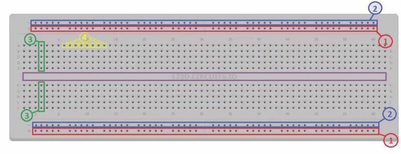
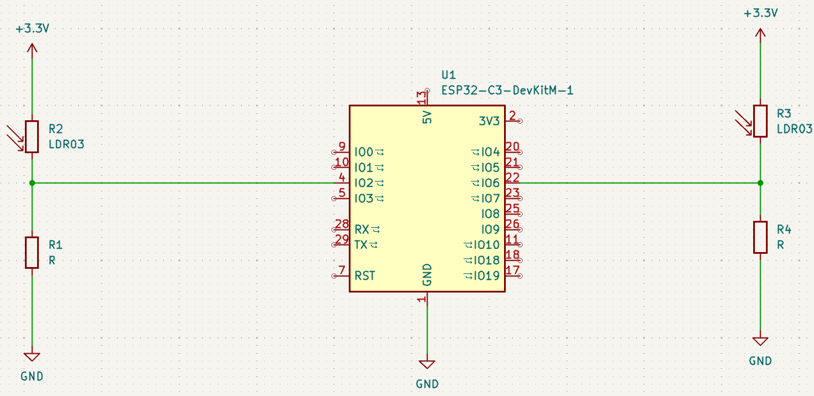

# Condicionales. 

Bienbenidos [inicio](/README.md).

- [Materiales](#materiales)
- [Coneccion de componentes](#coneccion-de-componentes)
- [Usar Thonny](#usar-thonny)
- [Condicionales](#condicionales)
- [Declaraciones if](#declaraciones-if)
- [Flujo de control elif else](#flujo-de-control-elif-else)
- [Or](#)
- [And](#and)
- [Módulo](#módulo)
- [Creando tu propia función de paridad ](#creando-tu-propia-función-de-paridad) 
- [Codificación pitónica](#codificación-pitónica)
- [Pythonic](#pythonic)
- [Match](#match)

## Materiales 
La lista de materiales es:
- 2 protoboard 
- 2 Sensores para deteccion de Luz LDR
- 2 resistencias de 10k Ohms 
- Esp32 DEVKITV1
- Cableado Jumper Electrónica "H - H" x 6
- Cable USB tipo A con entrada para micro puerto tipo B
- Computadora 
- Aplicación Thonny 

## Coneccion de componentes
Antes de comenzar debemos considerar los puentes de nuestro protoboard y conocer la distribucion vertical y Orizontal para las conecciones. En la siguiente imagen se te muestra un ejemplo de un protoboard mediante en las lineas en marcadas observamos la conductividad. 


Para empezar nesecitaremos conectar nuestro esp32 de manera que conecte los dos protoboards solicitados en la lista de materiales. despues utilizaremos nuestro cable de alimentacion para conectar el Esp32 a nuestra computadora, Enseguida colocaremos nuestros sensores y resistencias siguiendo el diagrama de la imagen. 




## Usar Thonny
Para empezar a usar Thonny nos ubicamos en la ventana del editor. al ya tener nuestros componentes especificados y conectados empezamos a redactar nuetro codigo.
Materiales:

1 ESP32

1 sensor LDR

1 resistencia de 10kΩ

cables de conexión

Conexión básica (divisor de voltaje):

Un extremo del LDR → 3.3V

El otro extremo del LDR → GPIO34

Resistencia de 10kΩ → entre GPIO34 y GND

Esto permite que el ESP32 lea el cambio de voltaje dependiendo de la luz.

## Condicionales.
Los condicionales nos permiten que el programa tome decisiones y elija un camino sobre otro dependiendo de las condiciones que especifiquemos.

En Python tenemos un conjunto de **“operadores”** que se utilizan para plantear preguntas matemáticas.

Los símbolos que utilizamos para establecer condicionales son los siguientes.

- **>=** denota “mayor o igual a”.
- **<=** denota “menor o igual a”.
- **\==** denota “igual”. Nótese el doble signo igual: un solo signo igual **=** asigna un valor, mientras que dos signos iguales **==** comparan valores.
- **\!\=** denota “no igual a”.

Las declaraciones condicionales comparan un término de la izquierda con un término de la derecha.

## Declaraciones If
En Python, las sentencias **if** se utilizan para tomar decisiones dentro del programa. Estas permiten ejecutar un bloque de código solo cuando una condición se evalúa como verdadera, de lo contrario, el programa puede ejecutar instrucciones alternativas o simplemente continuar su flujo normal.

En la ventana del editor de thonny comenzamos a redactar nuestro ejemplo para empesar a usar **if**. 

```Python
from machine import ADC, Pin
import time

# Configurar los pines analógicos
ldr1 = ADC(Pin(34))   # Primer LDR en GPIO 34
ldr2 = ADC(Pin(35))   # Segundo LDR en GPIO 35

# Ajustar la atenuación para rango de 0 - 3.3V
ldr1.atten(ADC.ATTN_11DB)
ldr2.atten(ADC.ATTN_11DB)

valor1 = ldr1.read()   # Valor de 0 - 4095
valor2 = ldr2.read()   # Valor de 0 - 4095
    
print("LDR1:", valor1, " | LDR2:", valor2)

    # Comparación usando solo IF
if valor1 < valor2:
        print("Hay menos luz en LDR1")
    
```

```console
MPY: soft reboot
LDR1: 3712  | LDR2: 3776
Hay menos luz en LDR1
```

Solo especificamos el codigo para que el codigo indique que **"X"** es menor a **"Y"** por lo tanto solo la respuesta señalara lo antes mencionado siendo **Y** mayor que **X**. 

## Ejemplo sensor LDR

```Python
from machine import ADC, Pin
import time

# Configurar los pines analógicos
ldr1 = ADC(Pin(34))   # Primer LDR en GPIO 34
ldr2 = ADC(Pin(35))   # Segundo LDR en GPIO 35

# Ajustar la atenuación para rango de 0 - 3.3V
ldr1.atten(ADC.ATTN_11DB)
ldr2.atten(ADC.ATTN_11DB)

while True:
    valor1 = ldr1.read()   # Valor de 0 - 4095
    valor2 = ldr2.read()   # Valor de 0 - 4095
    
    print("LDR1:", valor1, " | LDR2:", valor2)

    # Comparación usando solo IF
    if valor1 < valor2:
        print("Hay menos luz en LDR1")
    
    if valor2 > valor1:
        print("Hay más luz en LDR2")
    
    if valor1 == valor2:
        print("Ambos sensores tienen la misma luz")

    time.sleep(0.5)
```
El resultado esperado es:
```Console
LDR1: 3651  | LDR2: 3764
Hay menos luz en LDR1
Hay más luz en LDR2
LDR1: 3641  | LDR2: 2071
```
Observe cómo su programa toma la entrada del usuario para x e y, convirtiéndolas en enteros y guardándolas en sus respectivas variables x e y. Luego, la instrucción compara x e y. Si se cumple ifla condición de , se ejecuta la instrucción.x < yprint

ifLas sentencias utilizan boolvalores booleanos ( Trueo False) para decidir si se ejecuta el código. Si la comparación x > yes True, el intérprete ejecuta el bloque con sangría.

## Flujo de control elif, else.
Observe cómo proporciona una serie de <kbd>if</kbd> instrucciones. Primero, <kbd>if</kbd>se evalúa la primera instrucción. Luego, la segunda ifinstrucción ejecuta su evaluación. Finalmente, la última ifinstrucción ejecuta su evaluación. Este flujo de decisiones se denomina "flujo de control".
```Python 
from machine import ADC, Pin
import time

# Configurar los pines analógicos
ldr1 = ADC(Pin(34))   # Primer LDR en GPIO 34
ldr2 = ADC(Pin(35))   # Segundo LDR en GPIO 35

# Ajustar la atenuación para rango de 0 - 3.3V
ldr1.atten(ADC.ATTN_11DB)
ldr2.atten(ADC.ATTN_11DB)

valor1 = ldr1.read()   # Valor de 0 - 4095
valor2 = ldr2.read()   # Valor de 0 - 4095
    
print("LDR1:", valor1, " | LDR2:", valor2)

    # Comparación usando solo IF
if valor1 < valor2:
        print("Hay menos luz en LDR1")
        
if valor1 > valor2:
        print("Hay mas luz en LDR1")
        
if valor1 == valor2:
        print("El valor en LDR1 y LDR2 es igual")
```
Posibles resultados.

**Caso 1** Para menor deteccion de Luz en **LDR1**. 
```console
MPY: soft reboot
LDR1: 3996  | LDR2: 4031
Hay menos luz en LDR1
```
**Caso 2**Para mayor deteccion de Luz en **LDR1**.
```console
MPY: soft reboot
LDR1: 4021  | LDR2: 2793
Hay mas luz en LDR1
```

## Aplicaion de elif
Observe el uso de **elif** permite que el programa tome menos decisiones, Primero **if** se evalua la condicion es verdadera, ninguna de las **elif** demas se ejecutara, sin embargo si la **if** se evalua y es falsa, **elif** se evaluara la primera condicion si esta es verdadera, no se ejecutara la evaluacion final.
```Python
x = int(input("What's x? "))
y = int(input("What's y? "))

if x < y:
    print("x is less than y")
elif x > y:
    print("x is greater than y")
elif x == y:
    print("x is equal to y")
```
```Python
from machine import ADC, Pin
import time

# Configurar los pines analógicos
ldr1 = ADC(Pin(34))   # Primer LDR en GPIO 34
ldr2 = ADC(Pin(35))   # Segundo LDR en GPIO 35

# Ajustar la atenuación para rango de 0 - 3.3V
ldr1.atten(ADC.ATTN_11DB)
ldr2.atten(ADC.ATTN_11DB)

valor1 = ldr1.read()   # Valor de 0 - 4095
valor2 = ldr2.read()   # Valor de 0 - 4095
    
print("LDR1:", valor1, " | LDR2:", valor2)

    # Comparación usando solo IF
if valor1 < valor2:
        print("Hay menos luz en LDR1")
        
elif valor1 > valor2:
        print("Hay mas luz en LDR1")
        
elif valor1 == valor2:
        print("El valor en LDR1 y LDR2 es igual")
```
Posibles respuestas para los 3 casos.

Caso 1
```console
MPY: soft reboot
LDR1: 3056  | LDR2: 4095
Hay menos luz en LDR1
```
Caso2
```console
MPY: soft reboot
LDR1: 4089  | LDR2: 3050
Hay mas luz en LDR1
```
Caso3
```console
MPY: soft reboot
LDR1: 4095  | LDR2: 4095
El valor en LDR1 y LDR2 es igual
```

## Aplicasion de else.
Podemos crear un resultado predeterminado general usando una declarasion else. Podemos revisarlo de la siguiente forma. 

```Python
from machine import ADC, Pin
import time

# Configurar los pines analógicos
ldr1 = ADC(Pin(34))   # Primer LDR en GPIO 34
ldr2 = ADC(Pin(35))   # Segundo LDR en GPIO 35

# Ajustar la atenuación para rango de 0 - 3.3V
ldr1.atten(ADC.ATTN_11DB)
ldr2.atten(ADC.ATTN_11DB)

valor1 = ldr1.read()   # Valor de 0 - 4095
valor2 = ldr2.read()   # Valor de 0 - 4095
    
print("LDR1:", valor1, " | LDR2:", valor2)

    # Comparación usando solo IF
if valor1 < valor2:
        print("Hay menos luz en LDR1")
        
elif valor1 > valor2:
        print("Hay mas luz en LDR1")
        
else: 
        print("El valor en LDR1 y LDR2 es igual")
```
Posibles respuestas para los 3 casos **if**, **elif**, **"else"**.

Caso 1 
```console
MPY: soft reboot
LDR1: 3920  | LDR2: 3966
Hay menos luz en LDR1
```
Caso 2
```console
MPY: soft reboot
LDR1: 4095  | LDR2: 3000
Hay mas luz en LDR1
```
Caso 3
```console
MPY: soft reboot
LDR1: 4095  | LDR2: 4095
El valor en LDR1 y LDR2 es igual
```

Observe cómo proporciona una serie de ifinstrucciones. Primero, if se evalúa la primera instrucción. Luego, la segunda if instrucción ejecuta su evaluación. Finalmente, la última ifinstrucción ejecuta su evaluación. 

## Aplicasion de Or.
Or Permite que su programa decida entre una o más alternativas. Por ejemplo, podríamos editar nuestro programa de la siguiente manera.

```Python
from machine import ADC, Pin
import time

# Configurar los pines analógicos
ldr1 = ADC(Pin(34))   # Primer LDR en GPIO 34
ldr2 = ADC(Pin(35))   # Segundo LDR en GPIO 35

# Ajustar la atenuación para rango de 0 - 3.3V
ldr1.atten(ADC.ATTN_11DB)
ldr2.atten(ADC.ATTN_11DB)

valor1 = ldr1.read()   # Valor de 0 - 4095
valor2 = ldr2.read()   # Valor de 0 - 4095
    
print("LDR1:", valor1, " | LDR2:", valor2)


if valor1 < valor2 or valor1 > valor2:
    print("valor1 no es igual al valor2")
else:
    print("valor1 es igual al valor2")

```
Posibles resultados para los dos casos es **igual** y **no es igual que**.
```console
MPY: soft reboot
LDR1: 3770  | LDR2: 3790
valor1 no es igual al valor2
```

en el siguiente ejemplo mejoramos mas aun nuestro programa eliminando el operador **or**.
```Python
from machine import ADC, Pin
import time

# Configurar los pines analógicos
ldr1 = ADC(Pin(34))   # Primer LDR en GPIO 34
ldr2 = ADC(Pin(35))   # Segundo LDR en GPIO 35

# Ajustar la atenuación para rango de 0 - 3.3V
ldr1.atten(ADC.ATTN_11DB)
ldr2.atten(ADC.ATTN_11DB)

valor1 = ldr1.read()   # Valor de 0 - 4095
valor2 = ldr2.read()   # Valor de 0 - 4095
    
print("LDR1:", valor1, " | LDR2:", valor2)


if valor1 != valor2:
    print("valor1 no es igual al valor2")
else:
    print("valor1 es igual al valor2")
```
Posibles respuestas para los dos casos es **igual** o **no es igual** que.
```console
MPY: soft reboot
LDR1: 3482  | LDR2: 2915
valor1 no es igual al valor2
```
```console
MPY: soft reboot
What's x? 3
What's y? 3
x is equal to y
```
```Python
from machine import ADC, Pin
import time

# Configurar los pines analógicos
ldr1 = ADC(Pin(34))   # Primer LDR en GPIO 34
ldr2 = ADC(Pin(35))   # Segundo LDR en GPIO 35

# Ajustar la atenuación para rango de 0 - 3.3V
ldr1.atten(ADC.ATTN_11DB)
ldr2.atten(ADC.ATTN_11DB)

valor1 = ldr1.read()   # Valor de 0 - 4095
valor2 = ldr2.read()   # Valor de 0 - 4095
    
print("LDR1:", valor1, " | LDR2:", valor2)


if valor1 == valor2:
    print("valor1 es igual al valor2")
else:
    print("valor1 no es igual al valor2")
```
Posibles  respuestas para los dos casos **no es igual** y es **igual que**. 
```console
MPY: soft reboot
LDR1: 3613  | LDR2: 3466
valor1 no es igual al valor2
```
```console 
MPY: soft reboot
What's x? 3
What's y? 3
x is equal to y
```
## And.
Similar a or, and se puede utilizar dentro de declaraciones condicionales.
Ejecútalo en la ventana de terminal, Inicia tu nuevo programa como se indica a continuación:

hallo

```Python
from machine import ADC, Pin
import time

# Configurar los pines analógicos
ldr1 = ADC(Pin(34))   # Primer LDR en GPIO 34
ldr2 = ADC(Pin(35))   # Segundo LDR en GPIO 35

# Ajustar la atenuación para rango de 0 - 3.3V
ldr1.atten(ADC.ATTN_11DB)
ldr2.atten(ADC.ATTN_11DB)

valor1 = ldr1.read()   # Valor de 0 - 4095
valor2 = ldr2.read()   # Valor de 0 - 4095
    
print("LDR1:", valor1, " | LDR2:", valor2)


if valor1 >= 3000 and valor2 <= 4095:
    print("Grade: A")
elif valor1 >=2000 and valor2 < 3000:
    print("Grade: B")
elif valor1 >=1000 and valor2 < 2000:
    print("Grade: C")
elif valor1 >=500 and valor2 < 1000:
    print("Grade: D")
else:
    print("Grade: F")
```
```console
MPY: soft reboot
LDR1: 3869  | LDR2: 3933
Grade: A
```
```console
MPY: soft reboot
LDR1: 2512  | LDR2: 3890
Grade: F
```
```console
MPY: soft reboot
LDR1: 998  | LDR2: 991
Grade: D
```

```Python 
score = int(input("Score: "))

if score >= 90 and score <= 100:
    print("Grade: A")
elif score >=80 and score < 90:
    print("Grade: B")
elif score >=70 and score < 80:
    print("Grade: C")
elif score >=60 and score < 70:
    print("Grade: D")
else:
    print("Grade: F")
```
Posibles resultados 
```consola
MPY: soft reboot
Score: 97
Grade: A
```
Ejemplo Jerry
```python
from machine import ADC, Pin
import time

ldr = ADC(Pin(34))
ldr.atten(ADC.ATTN_11DB)   
ldr.width(ADC.WIDTH_10BIT) 

valor = ldr.read()
print(valor)
score = ldr.read()

if score >= 900 and score <= 1000:
    print("Grade: A")
elif score >=800 and score < 900:
    print("Grade: B")
elif score >=700 and score < 800:
    print("Grade: C")
elif score >=60 and score < 700:
    print("Grade: D")
```
```
MPY: soft reboot
833
Grade: B
```
Observa como en Python pueden encadenarse operadores y condiciones de una manera bastante inusual en otros lenguajes de programacion. 
```Python
score = int(input("Score: "))

  if 90 <= score <= 100:
      print("Grade: A")
  elif 80 <= score < 90:
      print("Grade: B")
  elif 70 <= score < 80:
      print("Grade: C")
  elif 60 <= score < 70:
      print("Grade: D")
  else:
      print("Grade: F")
```
```console

```
```Python
score = int(input("Score: "))

if score >= 90:
    print("Grade: A")
elif score >= 80:
    print("Grade: B")
elif score >= 70:
    print("Grade: C")
elif score >= 60:
    print("Grade: D")
else:
    print("Grade: F")
```
```console
MPY: soft reboot
Score: 97
Grade: A
```

## Módulo.
En matemáticas, la paridad se refiere a si un número es par o impar.
El operador módulo **%** en programación permite ver si dos números se dividen exactamente o se dividen y tienen resto.
Por ejemplo, **4 % 2** resultaría en cero, ya que es un divisor exacto. Sin embargo, **3 % 2** no es un divisor exacto y resultaría en un número distinto de cero.
En la ventana de terminal, crea un nuevo programa escribiendo code parity.py , En el editor de texto, escribe el código como se indica a continuación:

Ejemplo CHATGPT
```Python 
from machine import ADC, Pin
import time


ldr = ADC(Pin(34))              # Pin analógico
ldr.atten(ADC.ATTN_11DB)        # Rango de 0 a 3.3V


def leer_ldr():
    valor = ldr.read()
    return valor


valor = leer_ldr()

print("Valor del LDR:", valor)

# Evaluar si el número es par o impar usando módulo
if valor % 2 == 0:
    print("El valor es PAR")
else:
    print("El valor es IMPAR")
```
Posibles resultados
```console
MPY: soft reboot
Valor del LDR: 351
El valor es IMPAR
```
```console
MPY: soft reboot
Valor del LDR: 746
El valor es PAR
```
Ejemplo 1
```Python
from machine import ADC, Pin
import time

ldr = ADC(Pin(34))
ldr.atten(ADC.ATTN_11DB)   
ldr.width(ADC.WIDTH_10BIT) 

valor = ldr.read()
print(valor)
score = ldr.read()


if score % 2 == 0:
    print("Even")
else:
    print("Odd")
```
```console
MPY: soft reboot
4
Even
```
ejemplo mejorado 
```Python
from machine import ADC, Pin
import time

# Configurar el pin analógico donde está conectado el LDR
ldr = ADC(Pin(34))

# Ajustar el rango de lectura (0 - 3.3V)
ldr.atten(ADC.ATTN_11DB)

# Leer el valor del sensor
valor = ldr.read()

print("Valor del LDR:", valor)

# Uso del operador módulo
if valor % 2 == 0:
    print("El valor es PAR")
else:
    print("El valor es IMPAR")
```

```console
MPY: soft reboot
Valor del LDR: 85
El valor es IMPAR
```
```console
MPY: soft reboot
Valor del LDR: 16
El valor es PAR
```

## Creando tu propia función de paridad.
Como se discutió en la lección 0, ¡te resultará útil crear una función propia!
Podemos crear nuestra propia función para comprobar si un número es par o impar. Ajusta tu código como sigue:

```Python
from machine import ADC, Pin
import time

# Configurar el pin analógico donde está conectado el LDR
ldr = ADC(Pin(34))

# Ajustar el rango de lectura (0 - 3.3V)
ldr.atten(ADC.ATTN_11DB)

# Leer el valor del sensor
valor = ldr.read()

print("Valor del LDR:", valor)


def main():
    valor = ldr.read()
    if is_even(valor):
        print("Par")
    else:
        print("Impar")


def is_even(n):
    if n % 2 == 0:
        return True
    else:
        return False


main()
```
Resultado
```console
MPY: soft reboot
Valor del LDR: 349
Impar
```

```Python
def main():
    x = int(input("What's x? "))
    if is_even(x):
        print("Even")
    else:
        print("Odd")


def is_even(n):
    if n % 2 == 0:
        return True
    else:
        return False


main()
```
Posibles respuestas para los dos casos par e impar Even y Odd 
```console
MPY: soft reboot
What's x? 2
Even
```
```console
MPY: soft reboot
What's x? 3
Odd
```

## Pythonic
En el mundo de la programación, existen tipos de programación que se denominan "Pythonic". Es decir, existen formas de programar que a veces solo se ven en la programación Python. Considere la siguiente revisión de nuestro programa:
```Python
from machine import ADC, Pin
import time

# Configurar el pin analógico donde está conectado el LDR
ldr = ADC(Pin(34))

# Ajustar el rango de lectura (0 - 3.3V)
ldr.atten(ADC.ATTN_11DB)

# Leer el valor del sensor
valor = ldr.read()

print("Valor del LDR:", valor)


def main():
    valor = ldr.read()
    if is_even(valor):
        print("Par")
    else:
        print("Impar")


def is_even(n):
    return True if n % 2 == 0 else False


main()
```
Posibles respuestas para los dos casos par e impar Even, Odd. 
```console
MPY: soft reboot
Valor del LDR: 134
Par
```
```console
MPY: soft reboot
Valor del LDR: 672
Impar
```
Observe que esta declaración de retorno en nuestro código es casi como una oración en inglés. Esta es una forma única de codificar que solo se ve en Python.

Podemos revisar aún más nuestro código y hacerlo cada vez más legible:

```python
from machine import ADC, Pin
import time

# Configurar el pin analógico donde está conectado el LDR
ldr = ADC(Pin(34))

# Ajustar el rango de lectura (0 - 3.3V)
ldr.atten(ADC.ATTN_11DB)

# Leer el valor del sensor
valor = ldr.read()

print("Valor del LDR:", valor)

def main():
    valor = ldr.read()
    if is_even(valor):
        print("Par")
    else:
        print("Impar")


def is_even(n):
    return n % 2 == 0


main()
```
Posibles respuestas para los dos casos par e impar Even, Odd. 
```console
MPY: soft reboot
Valor del LDR: 227
Par
```
```console
MPY: soft reboot
Valor del LDR: 1056
Impar
```

## Match
De manera similar a las declaraciones if, elif, y else, match las declaraciones se pueden usar para ejecutar código condicional que coincida con ciertos valores.

```Python 
 name = input("What's your name? ")

  if name == "Harry":
      print("Gryffindor")
  elif name == "Hermione":
      print("Gryffindor")
  elif name == "Ron": 
      print("Gryffindor")
  elif name == "Draco":
      print("Slytherin")
  else:
      print("Who?")
```
Posibles respuestas para los 4 Nombres definidos en nuestro codigo. **Harry**, **Hermione**, **Ron** y **Draco**. En caso de ser otro Nombre la respuesta sera, Who?
```console
MPY: soft reboot
What's your name? Harry
Gryffindor
```
```console
MPY: soft reboot
What's your name? Hermione
Gryffindor
```
```console
MPY: soft reboot
What's your name? Ron
Gryffindor
```
```console
MPY: soft reboot
What's your name? Draco
Slytherin
```
```console
MPY: soft reboot
What's your name? Lovegood 
Who?
```
En nuestro suguiente ejemplo implementaremos **Or**.para que asi mejoremos un poco nuestro codigo.
```Python
 name = input("What's your name? ")

  if name == "Harry" or name == "Hermione" or name == "Ron": 
      print("Gryffindor")
  elif name == "Draco":
      print("Slytherin")
  else:
      print("Who?")
```

```console
MPY: soft reboot
What's your name? Harry
Gryffindor
```
```console
MPY: soft reboot
What's your name? Herione
Gryffindor
```
```console
MPY: soft reboot
What's your name? Ron
Gryffindor
```
```console
MPY: soft reboot
What's your name? Draco
Slytherin
```
```console
MPY: soft reboot
What's your name? Lovegood
Who?
```
EJEMPLOS MATH DAN ERROR, en Thonny.

```Python
name = input("What's your name? ")

match name: 
      case "Harry":
          print("Gryffindor")
      case "Hermione":
          print("Gryffindor")
      case "Ron": 
          print("Gryffindor")
      case "Draco":
          print("Slytherin")
      case _:
          print("Who?")
```
```console

```
```Python
 name = input("What's your name? ")

  match name: 
      case "Harry" | "Hermione" | "Ron":
          print("Gryffindor")
      case "Draco":
          print("Slytherin")
      case _:
          print("Who?")
```
```console

```
